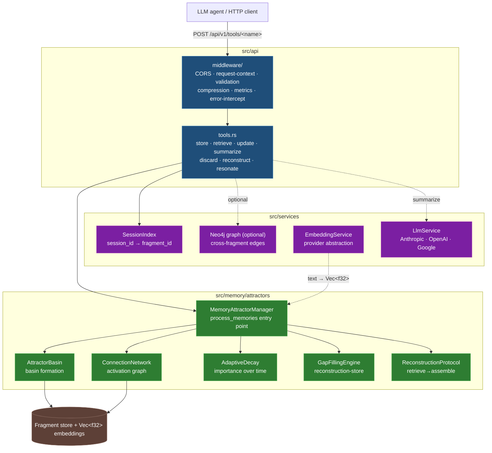
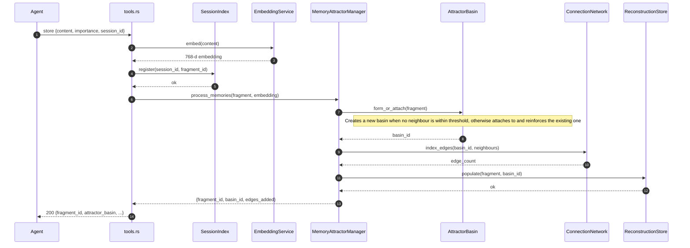
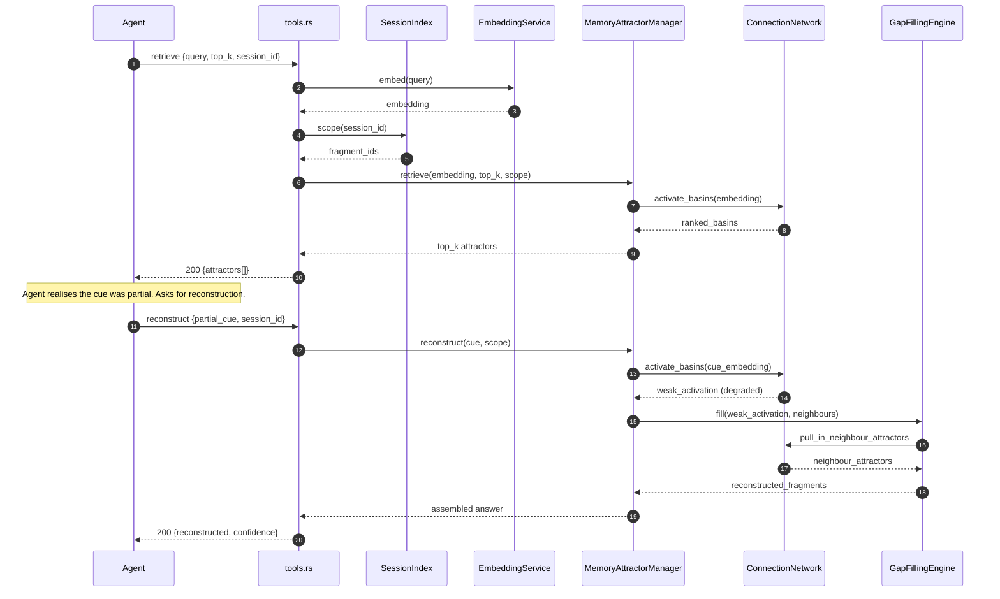
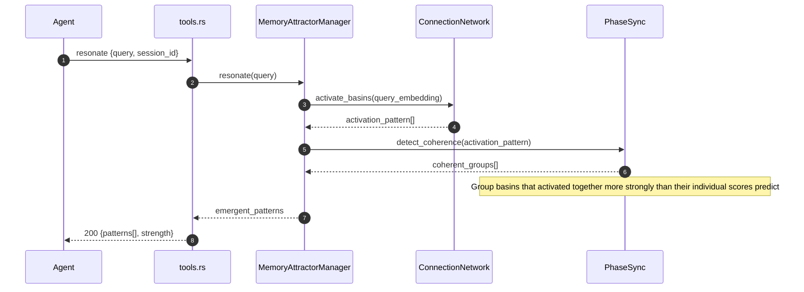
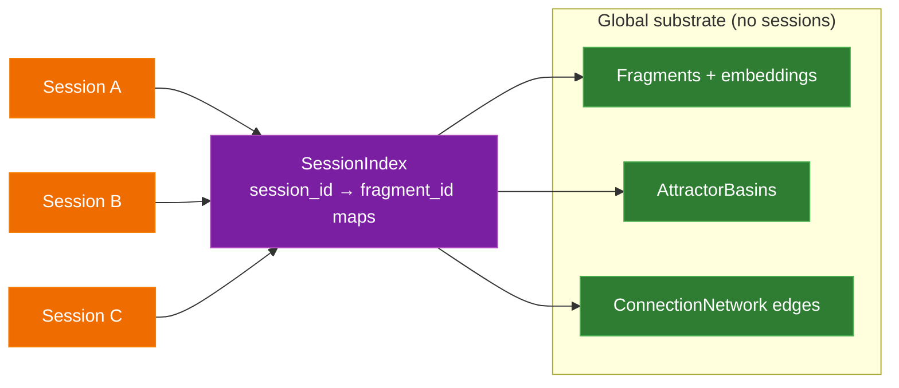

# ContextNest Architecture

How the substrate works under the seven-tool API — written for a reader who
has used the API once or twice and wants to understand the moving parts before
extending them.

## 1. Mental model

Treat memory the way the brain treats it, not the way a database does:

- **Fragments** are the atoms — short pieces of text agents care about.
- **Attractors** are crystallised fragments — when a fragment is stored, the
  substrate adapts the surrounding "field" so that related cues pull toward it.
- **Basins** are clusters of mutually-reinforcing attractors. When you store
  five fragments about the same bug, they end up in one basin and retrieval
  hits the basin, not five separate items.
- **Connection network** is the graph between basins. Activation in one basin
  raises activation in connected basins (the `resonate` mechanism).
- **Adaptive decay** keeps the field healthy: unused attractors weaken over
  time so the hot, recently-useful ones dominate retrieval.
- **Reconstruction** is gap-filling — a partial cue activates whatever it can,
  and the surrounding attractors fill in the rest into a coherent answer.

The key distinction from a vector database is that ContextNest doesn't just
return the closest item to a query; it lets the field do work — activation
spreads, neighbours contribute, and degraded retrieval produces useful output
instead of "no match".

## 2. System diagram

## 3. The store path

When an agent calls `POST /api/v1/tools/store`, this is what happens end to
end. `process_memories` is the single entry point — every store goes through
basin formation, network indexing, and reconstruction-store population in one
pass before the call returns.

The interesting property: storage is **idempotent on near-duplicates**. Two
fragments about the same bug land in one basin and reinforce it instead of
fragmenting the field.

## 4. The retrieve + reconstruct path

`retrieve` is similarity search with basin awareness. `reconstruct` adds
gap-filling — useful when the agent's cue is incomplete.

The trick on `reconstruct`: even when initial activation is weak, the
network's edges pull in adjacent attractors that the original cue didn't
match directly. The result is an answer assembled from fragments — not a
miss.

## 5. The resonate path

`resonate` is the differentiator vs flat vector stores. It looks for
emergent activation patterns: signal that doesn't come from a single
attractor, but from the geometry of how multiple attractors light up.

Concrete example: agent stores debugging fragments about three separate
issues over six weeks. Each individual fragment is unremarkable. But when
the agent later asks about a new error and `resonate` activates the field,
it surfaces "these three past issues share a common root cause you didn't
notice" — because they form a coherent activated group, not because any one
of them matched the query directly.

## 6. Session affinity

The substrate itself is global — basins and connection edges accumulate
across all sessions. The `SessionIndex` is a thin per-session overlay that
keeps `session_id → fragment_id` routing tables.

This means `retrieve` for session A doesn't return session B's fragments
(the index filters), but the basin geometry is shared. If two sessions
happen to store fragments that belong in the same basin, the basin
strengthens — even though neither session can see across the boundary.

The contract: a single mutating operation always writes to all three
`SessionIndex` maps (active / deleted / reverse) inside one `write()`
guard. Readers acquire only the map they need, so read concurrency stays
high. See `src/services/session_index.rs` for the consistency contract.

## 7. Concurrency model

| Layer | Lock | Reason |
|---|---|---|
| `SessionIndex` | `RwLock<HashMap>` × 3 | Reads dominate; writers acquire all three under one guard |
| `MemoryAttractorManager` | per-component locks (`AttractorBasin`, `ConnectionNetwork`) | Each component owns its state; manager orchestrates |
| `LlmService` | `tokio::sync::Mutex` on the underlying provider client | HTTP client is not Send-safe across awaits otherwise |
| Storage | `parking_lot::RwLock` on fragment store | Fastest non-async lock; fragment reads are the hot path |

Avoid holding the manager lock across `await` points. The `adaptive_decay`
module enforces this — its scheduler reads under a lock, drops it, then
executes the async decay operation. Pattern to follow for new code.

## 8. Why neural-field attractors vs flat vector store

The four behaviours you get for free that pgvector doesn't:

1. **Reinforcement on near-duplicates.** Same bug stored five different ways
   ends up as one strengthened basin, not five competing hits.
2. **Adaptive decay.** Stale debugging memories from six months ago don't
   dominate retrieval. Recently-useful basins stay sharp; cold ones fade.
   No cron jobs, no manual eviction policies.
3. **Reconstruction from partial cues.** Vector similarity returns nothing
   useful when the cue is degraded. The gap-filler assembles a coherent
   answer from neighbours.
4. **Emergent pattern surfacing.** `resonate` finds coherent groups —
   patterns that no single fragment carries but multiple together imply.
   This is the one that's hard to build on top of pgvector after the fact.

The cost: ContextNest is opinionated about how it stores. You can't drop
in arbitrary embeddings and expect the substrate to behave like a flat
store. Embed text fragments via the configured `EmbeddingService` and let
the manager decide basin assignment.

## 9. Where to read next

- [usage.md](usage.md) — practical how-to with curl examples per tool
- [`src/api/tools.rs`](../src/api/tools.rs) — request/response shapes
- [`src/memory/attractors/memory_attractor_manager.rs`](../src/memory/attractors/memory_attractor_manager.rs) — the orchestrator entry point
- [`src/services/session_index.rs`](../src/services/session_index.rs) — session-affinity contract
- [`src/services/llm.rs`](../src/services/llm.rs) — multi-provider LLM abstraction
- [CONTRIBUTING.md](../CONTRIBUTING.md) — canonical pipeline + adding a new tool
