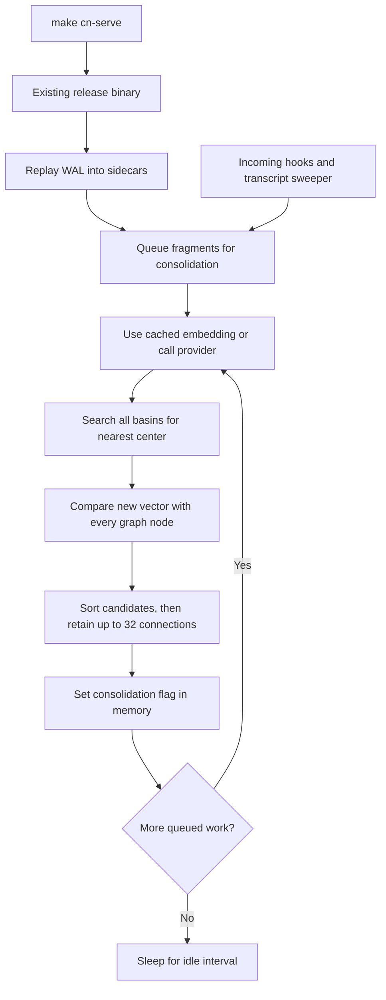

# CPU investigation: `make cn-serve`

Date: 2026-09-08, Europe/Berlin. Status: diagnosis complete; optimizations below are proposed, not implemented.

**Repair design:** [Tenant and session memory](../roadmap/epics/tenant-session-memory.md)
extends these findings with application tenants and isolated
sessions. Scope-local exact search is the first repair; approximate
indexing is conditional on measured session size and cost.

**The sampled CPU hotspot is background consolidation comparing each new fragment with the existing graph.** The graph scan happens before the 32-connection cap. A second search walks all attractor basins. At the observed substrate size, small arrivals can occupy most of one CPU core for several seconds.

The activity is bursty, not continuously pegged: a 20.22-second observation averaged **49.30% of one core**, with a **91.0%** peak; a later 30.28-second observation without the stack profiler averaged **7.23%**, with an **80.7%** peak. These are separate workload windows, not a before/after optimization comparison.

The first window overlaps stack profiling and two diagnostic GETs near its end.
The later window has no stack profiling or diagnostic GETs inside the CPU
measurement interval; its consolidation snapshots were taken before and after.

## What was measured

The existing process was inspected without starting, stopping, rebuilding, or changing the server. No ingest, merge, discard, or WAL mutation was requested. No application code or tests were changed.

| Observation | Result |
|---|---|
| Server | PID 79463, parent PID 79438 running `make cn-serve` |
| Launch | 2026-09-02 10:01:41 +02:00 |
| Listener | `127.0.0.1:28080` |
| Executable | `target/release/contextnest`, modified 2026-08-17 20:17:54 +02:00 |
| Checkout | `fix/consolidation-drain-cpu`, HEAD `ca817d8` |
| Runtime build identity | `/api/v1/substrate/config` reports `git_commit: "unknown"`; exact executable-to-commit provenance is unavailable |
| Stack sample | 12 seconds, 10 ms sampling interval |
| Process physical footprint | 5.4 GB; recorded peak 6.1 GB, from `sample` |
| Fragment inventory | 148,308 total; 148,224 flagged consolidated |
| Graph | 148,279 nodes; 3,199,761 edges |
| Basins | 85,435; average membership 1.736 |
| Worker | Queue 0; lag 84; last completed batch 11,305 ms at the first snapshot |
| Provider | Runtime model alias `qwen3-deepinfra`; local configuration specifies Qwen3 and 1,024 dimensions |
| Initial diagnostic GETs | Consolidation: HTTP 200 in 0.312 s; substrate health: HTTP 200 in 0.603 s |

During the later 30-second window, `succeeded_total` increased from 378,015 to 378,016, `failed_total` remained 35, and the queue was 0 at both checks. The latest batch duration changed to 4,201 ms. A batch duration includes network and scheduling time; it is not a measurement of CPU time per fragment. Queue depth also excludes an already drained, in-flight batch.

This evidence does **not** establish a current massive backlog or a rate-limit retry storm. The lag of 84 is also not proof of 84 actively retried items: failures leave the queue and are reconsidered at startup, and the status endpoint does not expose in-flight or terminally failed IDs.

[Recorded measurements](2026-09-08-cn-serve-cpu-evidence.json) preserve both CPU windows and the diagnostic API responses.

## Execution path



The diagram shows the successful processing path. Rate-limited batches have a separate backoff delay.

## Findings, in priority order

### 1. Full graph comparison is the measured CPU hotspot

Source: [connection_network.rs](../../src/memory/attractors/connection_network.rs), `create_connections_for_node`, lines 744–806; [mod.rs](../../src/memory/attractors/mod.rs), `cosine_similarity`, line 259.

The live call stack leads through `consolidate_one` → `MemoryAttractorManager::process_memories` → candidate collection → `cosine_similarity`. The sample's collapsed leaf counts include **582 observations in `cosine_similarity`**, 132 in the optimized `process_memories` frame, and 36 in `memcmp`. Sleeping runtime threads are excluded from the hotspot interpretation; these counts are not percentages of total process CPU.

For each new graph node, the code:

1. Holds the graph's synchronous read lock while iterating every existing node.
2. Calculates cosine similarity for every peer.
3. Collects all peers above the threshold, cloning their IDs.
4. Sorts those candidates and only then truncates to the configured maximum, default 32.

The cap bounds edge creation, but total work still includes `O(N × D)` vector comparison and `O(M log M)` candidate sorting, where N is graph size, D vector length, and M qualifying peers. The comment claiming total per-insert cost falls from O(N) to O(K) is misleading.

At approximately 148,000 nodes and the configured 1,024 dimensions, a new fragment entails roughly 152 million coordinate pairs for the dot products alone. The current cosine helper additionally recalculates both vector norms on every comparison. Actual CPU cost depends on vector lengths, compiler optimization, and memory locality.

**Suggested implementation:** first cache per-vector norms, or establish and validate a normalized-vector invariant before using dot products. Use a bounded top-K selection structure instead of sorting every qualifying peer. These reduce constants but still scan the graph. To change scaling, introduce a similarity index that selects candidates before exact scoring. An approximate index needs measured recall and neighbor-quality acceptance criteria; silently restricting comparisons to an arbitrary subset would change retrieval behavior.

### 2. Basin search and uninterrupted draining amplify each arrival

Source: [attractor_basin.rs](../../src/memory/attractors/attractor_basin.rs), `find_nearest_basin_with_distance`, line 670; [consolidation.rs](../../src/services/consolidation.rs), `run_worker`, line 567 and post-batch path at line 675.

Before graph insertion, each fragment also searches the entire basin map. This is up to `O(B × D)` work over about 85,000 basins. The August optimization compares squared distances and exits coordinate accumulation early, but still visits every basin. It reduces work per candidate, not the number of candidates.

The basin scan is confirmed in source. Optimized `process_memories` frames account for additional sampled work, but the release sample does not separately quantify the basin scan's CPU share.

Successful consolidation batches have **no post-batch delay**. `CONTEXTNEST_CONSOLIDATION_INTERVAL_MS` controls empty-queue sleep and the rate-limit backoff base, not a general CPU budget. The concurrency setting controls in-flight futures; synchronous vector loops within one worker task can still occupy one core. A configured 30-second `max_processing_time` is supplied in processing options but is not enforced by the manager's processing path.

**Suggested implementation:** index basin candidates and introduce explicit CPU/work pacing for successful batches. Chunk expensive scans or move them to a bounded blocking worker so they yield execution capacity to API requests. Moving work alone does not reduce total CPU. Tune pacing against consolidation lag, API latency, and retrieval readiness rather than blindly reducing concurrency.

### 3. Transcript sweeps reread unchanged files in full

Source: [cc_hooks.rs](../../src/api/cc_hooks.rs), `tail_and_ingest`, line 426, and `sweep_once`, line 676; [simple.rs](../../src/api/simple.rs), sweeper startup, line 56.

`tail_and_ingest` calls `tokio::fs::read` for the entire transcript **before** comparing its length with the stored offset. Even an unchanged file is fully read and allocated. A sweeper repeats this for every remembered transcript every 30 seconds. `SessionTracker` has no inactive-session eviction path in this implementation.

The live sample contains full-file reads in filesystem workers and sweeper allocation/free frames. This is observed secondary activity, not the dominant vector-comparison hotspot. The number and total bytes of tracked transcripts were not measured.

**Suggested implementation:** check file metadata first, seek to the last complete-record offset, and read only appended bytes. Retain explicit handling for truncation, replacement, and partial final lines. Serialize tailing per transcript so overlapping hook and sweep deliveries cannot process the same interval concurrently. Add a bounded inactive-session policy that preserves the dropped-hook recovery contract.

### 4. Health polling copies vectors it does not use

Source: [substrate.rs](../../src/api/substrate.rs), `get_substrate_health`, line 176; [attractor_basin.rs](../../src/memory/attractors/attractor_basin.rs), `list_snapshots`, line 643.

The health handler scans fragment metadata, parses timestamps, sorts ages, and requests complete basin snapshots. The snapshot function clones every center vector and member ID, although the handler only needs basin count and membership totals/maxima.

With 85,435 centers at the configured 1,024 dimensions, center copies alone would allocate about **334 MiB per request**, before member strings and other structures. This is a calculated size at the configured dimension, not an allocation-profiler measurement. One live health GET took 0.603 seconds. The dashboard's substrate route uses the default 30-second query refresh, so viewing it repeatedly invokes this path. No browser interaction or controlled measurement of dashboard-attributable CPU was performed.

**Suggested implementation:** expose aggregate basin statistics without cloning centers, maintain inexpensive counters where possible, and cache the metadata/age summary for a short period. This preserves the existing response contract.

### 5. Duplicate delivery and restart can repeat consolidation work

Source: [sink.rs](../../src/ingest/claude_code/sink.rs), `ServicesSink::store`, lines 314–366; [consolidation.rs](../../src/services/consolidation.rs), flag write at line 431; [tools.rs](../../src/api/tools.rs), `restore_sidecars_bulk`, line 461.

Stable fragment IDs prevent duplicate map entries, but `ServicesSink::store` replaces existing metadata with the incoming metadata and enqueues the ID again. A repeated delivery can therefore remove `_cn_consolidated` and rerun basin assignment. Existing graph nodes are rejected by `add_node`, so this does not necessarily repeat the full graph scan or create duplicate graph nodes; it still repeats other processing.

The cumulative success count exceeding the current fragment count is consistent with repeated processing, but counters alone cannot distinguish redelivery from deletion/history and are not proof of the exact number of duplicates.

On restart, the problem is broader: the success flag is changed in RAM, without a corresponding consolidation checkpoint write. WAL records from live ingest contain the original input metadata, and sidecar replay enqueues restored fragments. Canonical vectors, graph, and basin state are rebuilt. The source comment saying the flag survives restart and the epic's checked-off watermark requirement overstate the implementation.

**Suggested implementation:** preserve derived consolidation metadata on identical logical writes and deduplicate queued/in-flight work. A durable resume design must persist and restore the canonical state associated with its checkpoint. Persisting only the success flag would cause an empty canonical store to skip necessary reconstruction. This requires a separate persistence design and a backed-up, isolated restart test before touching the shared WAL.

This restart behavior explains repeated warm-up cost after `make cn-serve`; it is not proof that today's six-day-old process is still draining its startup backlog.

## What `make cn-serve` contributes

The [Makefile](../../Makefile) sets the WAL path and launches the release executable. The binary target at line 249 has no source prerequisites, so it builds only when the executable is absent. `make -n cn-serve` confirmed that this checkout would launch the existing executable without invoking Cargo.

Consequently, editing Rust code and rerunning `make cn-serve` does not by itself deploy a fix. The observed executable predates the latest checkout commit, and the runtime exposes no usable commit identity. The checkout already contains the earlier O(1) graph-metrics and pruned-basin-scan changes; the current graph-wide cosine scan remains independently established by the live stack sample.

For a later code fix, explicitly rebuild and let the operator restart the process. No rebuild or restart was performed during this investigation.

## Recommended follow-up tasks

All items below are **not started**. They are proposed remediation, not unfinished parts of the requested diagnosis.

| Order | Task | Acceptance evidence needed |
|---|---|---|
| 1 | Reduce graph/basin search cost and add successful-work pacing | Replay representative arrivals at approximately 150K fragments; compare CPU seconds per fragment, API latency, throughput, and neighbor/recall quality |
| 2 | Read only appended transcript data and prevent overlapping ingestion | Unchanged large transcript reads no content bytes; append, truncation, replacement, and partial-line cases preserve records |
| 3 | Return aggregate health statistics without vector snapshots | Same health response on a fixed fixture; lower allocation volume and CPU per request at approximately 85K basins |
| 4 | Preserve consolidation state on identical deliveries | Repeated logical record does not increment successful consolidation or basin membership |
| 5 | Persist canonical state and a compatible resume checkpoint | Restart an isolated copied substrate; queries remain valid and already processed records do not rerun |
| 6 | Make executable provenance visible and document rebuild behavior | Runtime reports a real commit ID; operator can verify the intended binary is running |

Lowering `CONTEXTNEST_MAX_CONNECTIONS_PER_NODE`, even to zero, still leaves the current graph scan in place. Increasing the idle interval does not pace successful batches. Disabling consolidation prevents new canonical basin/graph formation and is therefore a functional tradeoff, not a complete repair.

## Requirements review

The requested deliverable is an analysis of CPU use through `make cn-serve`, not an implementation change. Related task requirements were checked in [neural-field-real.md](../roadmap/epics/neural-field-real.md), [agent-context-pack.md](../roadmap/epics/agent-context-pack.md), [architecture-honest.md](../architecture-honest.md), and [development-workflow.md](../development-workflow.md).

- First pass: traced Make → process → WAL/bootstrap → consolidation → vector math; compared the worker, observability, and restart behavior with the documented requirements. The durable-resume discrepancy is recorded above and reopened in the epic.
- Second pass: checked the diagnostic claims against the stack sample, both CPU windows, API measurements, and referenced source paths. Confirmed that the quieter window has no growth in failed attempts; secondary costs and restart behavior are not presented as measured shares of the main CPU hotspot.
- No repair-performance claim is made. Build, lint, and application tests were not run because application code was unchanged. The diagnostic document and links were checked separately.

Reproduce the stack capture against the same still-running PID with:

```bash
sample 79463 12 10 -file /tmp/contextnest-sample.txt
```

PIDs change after restart. Record process CPU-time deltas over a window, not only an instantaneous CPU percentage, and compare equivalent workloads when evaluating a repair.

## Implementation follow-through

These measurements describe the original running binary, before the repair.
The concrete repairs are in the [tenant/session repair design](../roadmap/epics/tenant-session-memory.md).
No after-restart production CPU reduction is claimed by this report.
