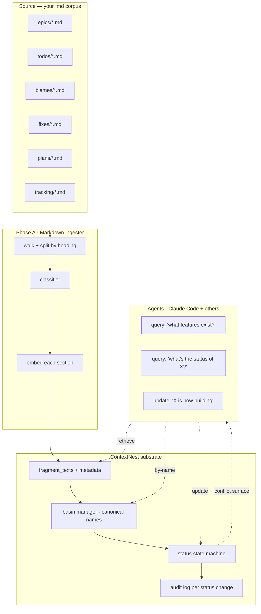
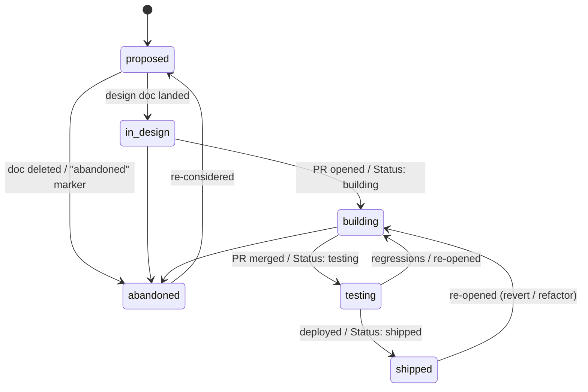

# Epic — Feature Knowledge Graph from Markdown Docs

**Status:** Proposal. ~3-4 weeks engineering across 5 phases (A–E).
Each phase independently shippable.

**Owner:** TBA.

**Last updated:** 2026-05-22.

## The problem

A real-world engineering project accumulates a pile of `.md` files:
epic specs, planning docs, todo lists, blameless postmortems, fix
notes, tracking sheets, retros. Humans skim them once and forget
them. Agents grep them, pull keyword matches out of context, and
hallucinate the rest.

The result: **the system's intent lives in markdown, but no agent
can answer "what is this product supposed to do?" reliably.**

Today, if a new Claude Code session lands in our repo and asks "is
feature X already shipped?", the honest answer is "grep four
directories, read six markdown files, infer from the tone of the
last commit message." That's not a substrate — that's archaeology.

## The goal

Turn the `.md` corpus into a **queryable feature knowledge graph**
where:

1. **Any agent** with a ContextNest connection can ask:
   - "What features should this system provide?"
   - "How is feature X supposed to work?"
   - "What's the current implementation status of feature X?"
   - "What conflicts exist between the spec and the current build?"
   and get **deterministic, sourced answers** — every claim
   anchored back to a markdown section + a mtime.
2. **Status moves forward without manual intervention** — when an
   agent flips a checkbox in a todo doc or writes
   `Status: shipped` in an epic, the substrate's view of that
   feature updates automatically.
3. **An agent can update status directly** via an HTTP/MCP call
   (`POST /api/v1/feature-specs/:id/status`) and the substrate
   reconciles that update with the doc-derived view, surfacing any
   conflict.

## Why ContextNest is the right core

A naïve "embed every paragraph in a vector store" approach
collapses too much signal. ContextNest already gives us the
ingredients to do this properly:

| Substrate capability (existing) | Used for in this epic |
|---|---|
| `MemoryKind` per-fragment kind enum | New `FeatureSpec` kind keeps spec records separate from runtime telemetry |
| `metadata` sidecar | Stores `source_doc`, `source_section`, `doc_mtime`, `status`, `linked_features` |
| Cosine retrieve | "Find feature most similar to this query" — semantic name resolution |
| Background consolidation worker (Phase 1) | Auto-clusters feature aliases into canonical IDs |
| AttractorBasinManager (Phase 3) | Each canonical feature becomes a basin; aliases are basin members |
| ConnectionNetwork (Phase 5) | "Linked features" edges encode spec-time relationships (depends_on, conflicts_with, supersedes) |
| Decay (Phase 2) | Old spec sections quietly fade; recent edits stay high-signal |
| `delivered_features` extractor | Cross-references runtime "what shipped" against doc "what was planned" |
| `/api/v1/features` endpoint | Already wired for the "by date" view; we extend with `?spec_status=...` |

The work is mostly **ingest + classification + state machine** on
top of a substrate that already handles the hard parts (semantic
clustering, persistence, decay, retrieve).

## High-level architecture



## Data model

### `MemoryKind::FeatureSpec` (new)

A new memory kind, distinct from the existing runtime `Feature`
kind (which records what agents actually shipped). `FeatureSpec` is
**what the docs say should exist**.

```rust
pub enum MemoryKind {
    // ... existing variants ...
    FeatureSpec,
}
```

### Per-fragment metadata shape

```jsonc
{
  // ===== identity =====
  "kind": "feature_spec",
  "feature_name": "query-overlay mode for /field viz",   // canonical, possibly cluster-derived
  "feature_aliases": ["query overlay", "search highlight in field"],

  // ===== source =====
  "source_doc": "docs/roadmap/epics/feature-knowledge-graph.md",
  "source_section": ["High-level architecture", "Data model"],   // heading path
  "source_lines": [120, 158],                                    // start-end line numbers
  "doc_mtime": "2026-05-22T11:00:00Z",

  // ===== classification =====
  "section_kind": "epic" | "todo" | "blame" | "fix" | "plan" | "tracking" | "reference",
  "status": "proposed" | "in_design" | "building" | "testing" | "shipped" | "abandoned",
  "status_source": "doc" | "agent" | "inferred",
  "status_ts": "2026-05-22T11:00:00Z",

  // ===== graph =====
  "depends_on": ["consolidation worker", "real basins surface"],   // outgoing edges
  "supersedes": ["old field viz design"],
  "conflicts_with": [],

  // ===== freshness / decay =====
  "ts": "2026-05-22T11:00:00Z"
}
```

### Status state machine



Transitions are enforced by `POST /api/v1/feature-specs/:id/status`.
Forbidden transitions return `409 Conflict` with the legal next
states listed in the response body.

## Phases

### Phase A — Markdown ingester

**Goal:** Walk `.md` files, split by heading, store each section as
a fragment with provenance metadata.

**Surface:**
```bash
contextnest ingest markdown <root-dir> [--watch] [--since <duration>]
```

**Per-file pipeline:**
1. Parse front matter (YAML between `---` blocks) if present.
2. Build heading tree from ATX (`#`) and Setext (`===`/`---`)
   headers.
3. Slice the file into sections at the deepest heading level that
   doesn't fragment paragraphs.
4. For each section:
   - Compute `source_lines: [start, end]`
   - Compute `source_section: [...heading path]`
   - Set `doc_mtime` from file metadata
   - Send to substrate via `/api/v1/tools/store` with the FeatureSpec
     kind + metadata above

**Skip rules:**
- Fenced code blocks captured but not classified (they're examples,
  not spec)
- Tables retained verbatim
- Empty sections skipped
- Files in `.git/`, `node_modules/`, `target/` excluded by default
  (configurable via `--include` / `--exclude` globs)

**Idempotency:** Same `(source_doc, source_section, source_lines)`
tuple → same fragment id (deterministic UUIDv5). Re-ingest of an
unchanged section is a no-op. A changed section replaces the prior
record (soft-delete old, store new).

**Watch mode:** Uses `notify` crate to react to file changes; rate-
limited to 1 ingest pass per file per 2 seconds to absorb editor
saves-in-a-burst.

**New module:** `src/ingest/markdown/`
- `walker.rs` — file discovery + filter
- `parser.rs` — heading + section splitting (use `pulldown-cmark`)
- `record.rs` — build `MemoryRecord` from a section
- `mod.rs` — orchestrator + watch loop

**Tests:**
- Heading tree of a fixture .md matches expectation
- Re-ingest of unchanged file produces zero new fragments
- Re-ingest of changed section soft-deletes old + creates new
- Watch mode catches a file write within 2s

### Phase B — Classification + canonicalization

**Goal:** Tag each section with `section_kind` and `status`, and
collapse alias feature names into canonical IDs.

**Classification — `section_kind`:**

Fast heuristic first; LLM fallback only on ambiguity.

| Signal | → section_kind |
|---|---|
| File path matches `epics/` or `roadmap/` | `epic` |
| File path matches `todos/` or `todo/` | `todo` |
| Filename matches `blame*`, `postmortem*` | `blame` |
| Filename matches `fix*`, `bug*` | `fix` |
| Filename matches `plan*` | `plan` |
| Section heading contains "Status:", "Done:", "TODO" | `todo` |
| First paragraph starts with "We will" / "Add" / "Implement" | `plan` |
| ≥ 3 of these markers fail | LLM falls back (`gpt-4o-mini`-class), 1 call per ambiguous section |

**Classification — `status`:**

| Signal | → status |
|---|---|
| `- [x]` checkbox count == total | `shipped` |
| `- [ ]` checkboxes only | `proposed` or `building` (depends on age) |
| `Status: <value>` literal | `<value>` directly (validated against enum) |
| Section recently created + no checkboxes | `proposed` |
| Section last modified > 90 days ago, no progress markers | `abandoned` (heuristic, flagged) |

**Canonicalization (the substrate-native part):**

Step 1 — collect all candidate feature names per section (from
heading + `Feature:` field if present + first noun phrase).

Step 2 — embed each candidate name via `EmbeddingService`.

Step 3 — for each candidate, ask
`attractor_manager.basin_manager.find_nearest_basin(emb)`:
- Within threshold → it's a member of that basin; basin's
  representative name becomes canonical.
- Out of threshold → create a new basin seeded with this name.

Result: aliases like "query overlay", "search highlight in field",
"context picker on /field" all collapse to one canonical
`feature_name` (whichever name has the most fragments pointing at
the basin wins).

**New methods on `MemoryAttractorManager`:**
- `pub async fn name_basin(&self, basin_id: &str, label: &str)` —
  attach a human-readable label to a basin (used to track the
  canonical feature name)

**Tests:**
- 5 sections naming the same feature 5 different ways collapse to 1
  canonical name
- "Feature: X" front matter overrides heuristic name extraction
- Status heuristics produce expected enum values for 8 representative
  fixtures

### Phase C — Status state machine + update endpoint

**Goal:** Let agents (and the daemon) transition feature status
through legal states with audit logging.

**New endpoint:**
```
POST /api/v1/feature-specs/<canonical-name>/status
Content-Type: application/json
{
  "to": "building",
  "reason": "PR #46 opened",
  "actor": "claude-session:<uuid>" | "agent:<name>" | "doc-watcher",
  "evidence": {
    "type": "pr" | "commit" | "doc-edit" | "manual",
    "ref": "PR #46" | "commit abc1234" | "docs/foo.md@line:42" | null
  }
}
```

**Response:**
- `200 OK` — transition applied; returns new state + audit id
- `409 Conflict` — illegal transition; body lists legal next states
- `404 Not Found` — no FeatureSpec records for that canonical name

**Audit:** Every status change emits a new fragment with
`MemoryKind::FeatureSpec` carrying `metadata.kind="feature_spec"`,
`metadata.status_change`, `metadata.from`, `metadata.to`,
`metadata.actor`, `metadata.evidence`. Audit records have very high
importance + no decay (they're history, not signal).

**State store:** The "current status" of a feature is computed by:
1. Pull all FeatureSpec records for the canonical name.
2. Sort by `status_ts` desc.
3. Take the freshest record's `status` value.
4. Cross-check against `status_change` audit records — they
   override doc-derived values if newer (agent updates trump doc
   inference).

**Conflict surface:** When a doc says `building` and a recent agent
update says `shipped`, the GET endpoint returns:
```jsonc
{
  "canonical_name": "query-overlay mode",
  "status": "shipped",
  "status_source": "agent",
  "status_ts": "2026-05-22T11:00:00Z",
  "conflicts": [
    {
      "source": "doc",
      "value": "building",
      "doc": "docs/todos/2026-05-22-foo.md",
      "doc_mtime": "2026-05-22T10:30:00Z"
    }
  ]
}
```

Agents reading this know to either (a) update the conflicting doc
or (b) flip the spec back to `building` if the agent's update was
wrong.

### Phase D — Doc-derived inference loop

**Goal:** When a markdown file changes, re-classify the affected
sections and apply any implied status transition automatically.

**Pipeline:**
1. Watcher fires on file change.
2. Re-ingest pipeline runs for the changed file.
3. For each section whose `status` differs from the previous
   ingest of the same section:
   - Compute the implied transition.
   - If the transition is legal under the state machine, apply it
     via the same `POST /api/v1/feature-specs/:name/status`
     endpoint, with `actor="doc-watcher"` and
     `evidence={type:"doc-edit", ref:"<doc>:line:<n>"}`.
   - If illegal, emit a `kind=blocker` fragment describing the
     impasse so the inbox surfaces it.

**Conservative rule:** The watcher never moves status BACKWARD
from `shipped` or `building` via doc edits alone — going backward
requires an explicit agent or manual update. This stops a
typo in a todo doc from "un-shipping" a feature.

**Throttling:** A single file edit can trigger many section
re-classifications. Coalesce all changes from one file mtime tick
into a single batch with one round of audit records.

### Phase E — Agent query surface

**Goal:** Agents (and the dashboard) can answer the four key
questions deterministically.

**Endpoints:**

| Endpoint | Answers |
|---|---|
| `GET /api/v1/feature-specs` | "What features should this system provide?" |
| `GET /api/v1/feature-specs?status=building` | "What's in flight right now?" |
| `GET /api/v1/feature-specs?since=7d` | "What's been added/changed this week?" |
| `GET /api/v1/feature-specs/<canonical-name>` | Full spec aggregated across docs |
| `GET /api/v1/feature-specs/<canonical-name>/sources` | Every fragment that contributed to the spec, sorted by mtime |
| `GET /api/v1/feature-specs/<canonical-name>/audit` | Status-change history |
| `GET /api/v1/feature-specs?q=<query>` | Semantic search across spec text |

**MCP tool surface (so Claude can use this natively):**

```
cn_feature_specs(query?, status?, since?)
  → list of {canonical_name, status, latest_ts, doc_count}

cn_feature_spec(name)
  → full aggregate: {canonical_name, status, status_source,
                     description (synthesized from highest-importance
                     fragments), depends_on, conflicts_with,
                     sources: [...], audit: [...]}

cn_feature_spec_update(name, to_status, reason, evidence)
  → applies the transition
```

**Aggregate `description` synthesis:** Pull the top-N FeatureSpec
fragments for the canonical name (sorted by importance × decay),
concatenate, run through the LLM (existing `LlmService`) with a
prompt like:

```
Summarize the following spec excerpts into a single canonical
description of feature "<name>". Preserve every concrete
requirement. Mark contradictions explicitly. Output ≤ 400 words.
```

Cache the synthesized description with a `synth_ts` and re-run only
when source fragments change.

### Phase E.1 — Dashboard surface (deferred V2)

`/features/spec` route. Tabs for `proposed`, `in_design`, `building`,
`testing`, `shipped`. Each card:
- Canonical name + status chip
- Synthesized description (with "View sources" expand)
- Depends-on / conflicts-with chips → click navigates
- Audit timeline on the side panel

Shipped after phases A-D ship and we have real data to render
against.

## Operational concerns

### Re-ingest cadence

Watch mode is the happy path for fresh substrates. For onboarding
a large corpus:
```bash
contextnest ingest markdown docs/ --since 90d
```
processes anything modified in the last 90 days first; older docs
follow in a background pass. Default `--since 1y` for the
first-ever ingest.

### Conflict resolution

When multiple docs disagree about a feature's status:
1. Most recent `doc_mtime` wins for `status_source="doc"`.
2. Most recent agent update wins for `status_source="agent"`.
3. Agent updates trump doc-derived values **of equal recency**
   (within 5 minutes). Older agent updates don't override fresh
   doc edits.
4. The conflicting other values appear in the `conflicts` array of
   the GET response so a human / agent can resolve.

### Decay tuning

FeatureSpec records use a longer half-life than runtime telemetry —
the spec doesn't get stale at the same rate.

Recommended overrides:
- `MemoryKind::FeatureSpec` half-life: 180 days
- Audit records (`status_change`): no decay
- Aliases (`feature_alias` sub-kind): match canonical

Configurable via new env vars:
```
CONTEXTNEST_DECAY_HALF_LIFE_FEATURE_SPEC_DAYS=180
CONTEXTNEST_DECAY_HALF_LIFE_AUDIT_DAYS=infinity
```

### Privacy / sensitivity

The markdown corpus may contain credentials, internal URLs, or
PII. The ingester respects:
- `.contextnest-ignore` files (gitignore syntax)
- A `<!-- contextnest:skip -->` HTML comment marker at the start of
  any section
- `CONTEXTNEST_INGEST_REDACT_PATTERNS` env var for global regex
  redaction at section read time

### Storage cost

A typical engineering corpus: ~500 .md files × ~10 sections each ×
~500 tokens per section = ~2.5M tokens. At 256-d embeddings
that's ~5 GB raw. ContextNest's per-fragment overhead adds ~30%.
Plan ~7 GB headroom for an enterprise repo.

## Agent integration patterns

### Pattern 1 — Bootstrap a new session

A fresh Claude Code session asks "what does this codebase do?"
before touching any file:
```
cn_feature_specs(status=building)
cn_feature_specs(status=shipped, since=7d)
```
Returns the in-flight work + recently-shipped features. Claude
reads the synthesized descriptions and knows the project's intent
in <2 seconds, regardless of `.md` corpus size.

### Pattern 2 — Implementation kickoff

Before writing code for "feature X":
```
cn_feature_spec("feature X")
```
Returns the spec, its dependencies, prior attempts (sources sorted
by mtime), and current status. If status is already `building`,
Claude finds the most recent agent's session id and offers to
continue from where they left off.

### Pattern 3 — Status update on PR open

When Claude opens a PR for feature X:
```
cn_feature_spec_update(
  "feature X", to="building",
  reason="PR #47 opened",
  evidence={"type":"pr","ref":"PR #47"}
)
```
If the spec already has status=building from a doc edit, this is a
no-op + appends an audit record cross-referencing the doc and the
PR — useful for tracing later.

### Pattern 4 — Doc/code drift detection

A cron-scheduled agent runs:
```
cn_feature_specs(status=shipped)
```
For each, runs the spec's `how_to_test` recipe (from the existing
`delivered_features` index). Any failure triggers a status
revert from `shipped` to `building` with `evidence.type="test-fail"`.

This is the "trust but verify" loop that keeps the substrate
honest about what's actually working.

## Risks + open questions

| Risk | Likelihood | Mitigation |
|---|---|---|
| Markdown is too unstructured; classifier mis-labels too much | Med | LLM fallback on ambiguous sections; conflict surface lets humans correct |
| Cluster threshold too tight → too many singleton features | Med | Threshold tunable via env; basin-merge worker (Phase 3 of neural-field epic) already merges close basins automatically |
| Cluster threshold too loose → distinct features collapse into one | Med | `Feature:` front matter overrides clustering; explicit `aliases:` field lets authors lock the grouping |
| `cn_feature_spec_update` race when two agents update simultaneously | Low | Endpoint takes a `expected_current_status` field; mismatched → 409 with the actual current value |
| Watcher misses changes on network filesystems | Low | Fallback to periodic full scan every 1 hour (configurable) |

**Open questions to resolve before Phase A:**

1. Where does the canonical name live when it's just inferred from
   clustering? Today the substrate doesn't have a primary-key store
   per canonical name. **Proposed:** the basin's id is the
   canonical name's stable key; the basin's `label` field (new in
   Phase B) is the human-readable name.

2. How do we handle multi-language docs (e.g., `epics/de/X.md` +
   `epics/en/X.md` describing the same feature)? **Proposed:**
   defer to V2; in V1, ingest both and accept they'll cluster
   together via embedding similarity (multilingual embedders
   already do this).

3. Should code-block contents inside a spec section be indexed?
   They're often the source-of-truth for "this is exactly what the
   API shape will be". **Proposed:** index code blocks as
   `MemoryKind::FeatureSpec` with `metadata.kind="feature_spec"`
   and `metadata.code_block=true`. Excluded from semantic search
   results by default but included when a query asks for "API
   shape of X".

## Acceptance — what success looks like

After all 5 phases ship, this conversation should be possible from
any Claude Code session in your repo:

> **User:** What's the status of the inbox feature?
>
> **Claude:** Inbox feature is **shipped** as of 2026-04-18.
> Canonical name `inbox`. Synthesized from 7 doc sources (most
> recent: `docs/roadmap/epics/cc-ingest/INDEX.md:12`). Depends on
> `cc_hooks ingest`, `session_index`, `attractor_manager`. No open
> conflicts. Audit shows 3 status changes since 2026-03-30; last
> change by `claude-session:<uuid>` with evidence `PR #24`.
>
> Want me to surface the synthesized description, or jump straight
> to the sources?

…and this update should "just work":

> **Agent (auto):** Detected `docs/roadmap/epics/neural-field-real.md`
> edited 12s ago. Section "Phase 7" status changed `building` →
> `shipped`. Applying transition. Audit record `a-9f2c…` written.

…and this query, central to onboarding:

> **User:** What features should this system provide?
>
> **Claude:** 47 specs across 6 status buckets. 12 shipped, 8 in
> testing, 14 building, 9 in design, 3 proposed, 1 abandoned. Top
> 5 by recency: …

## Phasing summary

| Phase | Surface | Lines (est) | Ships independently? |
|---|---|---|---|
| A — Markdown ingester | `contextnest ingest markdown` CLI + watch | ~800 | Yes (substrate gains `.md` fragments but no new query surface) |
| B — Classify + canonicalize | classifier + basin labelling | ~600 | Yes (existing endpoints surface the new metadata; no new endpoints needed) |
| C — Status state machine + update | `POST /api/v1/feature-specs/:name/status` + audit | ~700 | Yes |
| D — Doc-derived inference | watcher reconciliation loop | ~400 | Depends on A-C |
| E — Agent query surface | `GET /api/v1/feature-specs/*` + MCP tools | ~600 | Depends on A-C; D is optional |

Total ~3100 LOC + tests. Each phase ~3-5 days of focused work.

## Verification recipe

After each phase, this grep should return at least one hit from
outside `src/ingest/markdown/`:

```bash
# Phase A
grep -rn "MemoryKind::FeatureSpec\|MemoryKind::FeatureSpec" src/api/

# Phase B
grep -rn "feature_aliases\|canonical_name" src/api/

# Phase C
grep -rn "status_change\|/api/v1/feature-specs" src/api/

# Phase D
grep -rn "doc_watcher\|status_inferred" src/services/

# Phase E
grep -rn "cn_feature_spec\|feature_specs_router" src/api/ src/mcp/
```

When all five pass, the substrate has earned the "feature
knowledge graph" name — and your `.md` corpus has become a
queryable, self-updating spec.
