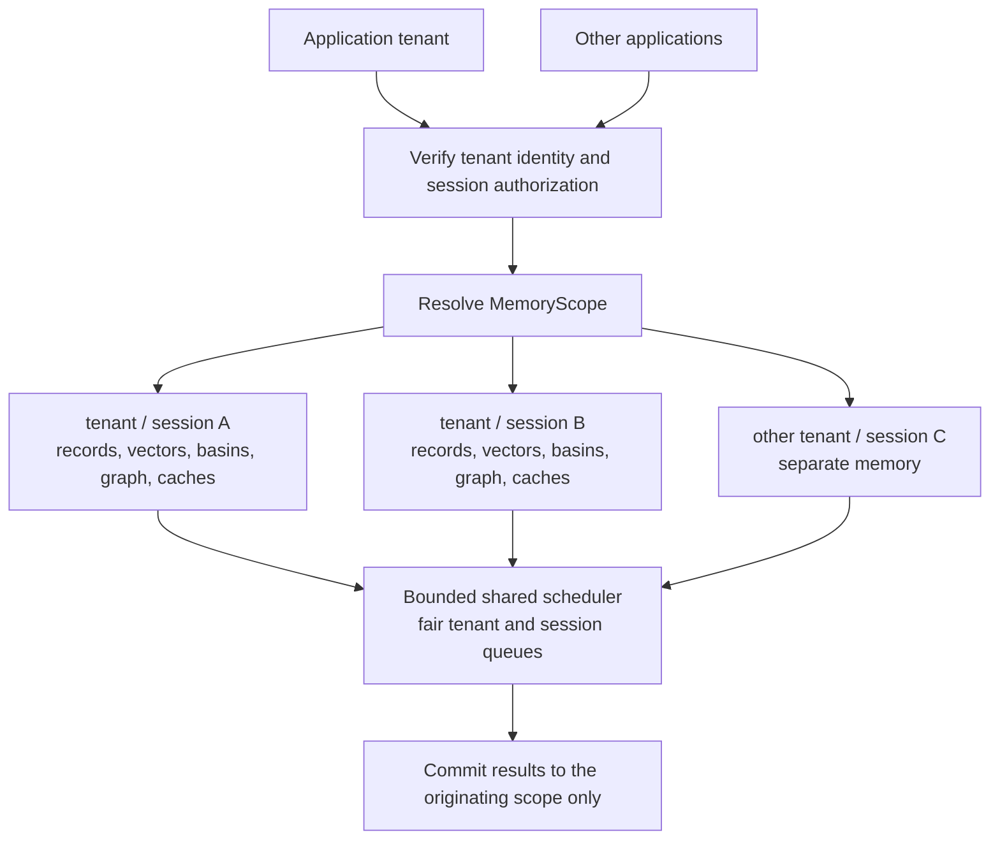

# Tenant and session memory: CPU repair design

**Status:** Implemented in a feature branch; live activation and workload acceptance remain operator-controlled.
**Date:** 2026-09-08.
**Requirements:** Explain the proper repairs for the [CPU findings](../../reports/2026-09-08-cn-serve-cpu.md), support application-side integrations as tenants, and isolate the individual sessions those applications create.

## The boundary

A **memory scope** is one authenticated application tenant and one authorized application session: `(tenant_id, session_id)`.

Each application tenant owns its scope. Each session under that tenant owns its memories. Neither another application nor another session of the same application participates in that session's retrieval, basins, graph, summaries, reconstruction, caches, or consolidation. Individual-user tenancy is not a requirement of this design; user authorization can be added above the session ownership model later.

Register an application identifier independently of any local checkout path, so moving or renaming a development directory does not move or rename memory.

Keep application runtime memory separate from coding-agent transcripts about that application. A new application tenant's conversation memory should start as a new, empty scope; existing project-tagged developer transcripts are not automatically imported into it.



The service may share transport clients and bounded compute capacity. Memory state remains scoped. In-process separation is a logical application boundary; separate processes or containers are an additional option when hard resource or process isolation is required.

## Baseline evidence before the repair

| Location | Current behavior | Required change |
|---|---|---|
| `src/services/mod.rs::ContextNestServices` | One attractor manager and shared maps/caches/queue | Separate shared infrastructure from tenant/session memory state |
| `src/services/session_index.rs::SessionIndex` | Session routing over shared canonical state | Scope ownership throughout storage and canonical processing |
| `src/api/tools.rs::retrieve` | Missing session means global search; optional `session_ids` enables cross-session search | Session-bound callers cannot select global or foreign-session scope |
| `src/api/middleware/request_context.rs::extract_user_id_from_auth` | Returns `None`; built-in authentication is not implemented | Verify tenant credentials before constructing a memory scope |
| `src/services/consolidation.rs::consolidate_one` | Operates on global manager, keyed by fragment ID | Carry scope and content/model revisions through the complete job |
| Example application memory adapter | Sends a session ID but no tenant credential; defaults to port 8080 | Bind the adapter to authenticated application/session context; explicitly configure the cn-serve URL |
| Example session-factory pattern in an application | Generates an ephemeral archive ID inside the factory | Accept the application's canonical session ID, with clear new/resume semantics |
| Example live-session pattern in an application | Uses a per-instance archive ID | Verify that archive identity follows the session lifecycle rather than incidental service recreation |

These are the pre-repair source observations that motivated the implementation, not current v2 behavior. An application adapter is opt-in via its own configuration; typical constraints include short recall timeouts, bounded in-flight stores, and fail-soft behavior.

## 1. Enforce tenant and session ownership before accessing memory

Use a server-verified tenant credential and a typed `MemoryScope` passed to repositories and workers. Do not derive authorization from a caller-provided `project_cwd`, metadata field, or unverified tenant header. This follows the trust-boundary guidance in the [OWASP multi-tenant security guide](https://cheatsheetseries.owasp.org/cheatsheets/Multi_Tenant_Security_Cheat_Sheet.html).

For local application integration, a registered application credential can create sessions. A session registration returns a credential/capability restricted to that session's read/write operations. An application's memory adapter then holds only that session capability. A body or route session selector must match the verified scope. A session-bound token can supply its session implicitly; an otherwise unscoped request must be rejected rather than defaulting to global search.

Keep credentials in trusted application-side configuration, not hard-coded into the distributed renderer bundle or logged with requests. Session IDs identify records; knowing an ID must not authorize access.

Introduce a structure equivalent to:

```text
AppServices
  shared provider transports, global compute limits, tenant registry
  TenantRuntime[tenant_id]
    tenant policy, credentials, durable store, tenant quotas
    SessionSubstrate[session_id]
      record/vector store, SessionIndex, basins, graph, derived caches
```

The conceptual names above map to `Registry`, `Tenant`, `MemoryScope` and per-session `CanonicalSnapshot` in `src/services/tenants/`. Transport clients and bounded compute are shared; canonical views load lazily into a bounded cache.

Move per-tenant choices into a versioned `TenantPolicy`: permitted ingestion
adapters, memory kinds, retention, embedding-space identity, graph settings,
and work limits. Process-wide environment variables cannot express different
policies for simultaneous tenants. A typical initial profile is a conversation
archive with session isolation and no implicit cross-session recall.

Every derived-cache identity includes its scope and the relevant content/model
revision. Sharing a provider HTTP client does not imply sharing its memory or
response cache. Jobs, file offsets, and deduplication keys carry scope too.

An ownership audit must cover store, retrieve, update, discard, summarize, reconstruct, resonate, fragments, sessions, features, inbox, field views, exports, LLM caches, hooks, coordination, and background work. Each surface is either scoped to the caller or explicitly restricted to an operator capability. Global operator views need deliberate authorization; the current unauthenticated global behavior cannot remain a back door into new tenants.

**Example:** a capability for `tenant/session-A` cannot use `session_id=session-B`, a `session_ids` list, or a known foreign fragment ID to read or change B. A summary or graph expansion from A also cannot inspect B.

## 2. Fix graph and basin CPU at the same boundary

For a session-bound conversation adapter, first use **exact search inside one session**, with cached vector norms and bounded top-K selection. This reduces the number of candidates while preserving exact scoring within the intended scope. A hypothetical 500-record session compares at most its own 500 records, rather than the approximately 148,000 graph nodes observed in the diagnostic run. That is a candidate-count comparison, not a claimed runtime speedup.

Maintain scope-local basin and graph indexes. Keep a single authoritative vector representation where practical and share immutable vector buffers within the scope, rather than repeatedly copying vectors between sidecars and temporary scan results. Cached norms must be invalidated with vector revision; zero, nonfinite, and wrong-dimension vectors need explicit handling.

Do not normalize basin centers merely to use dot products. Basin merging currently computes weighted centers, which need not have unit norm; changing them would change Euclidean attachment behavior. Preserve the current metric and threshold. Exact optimized scoring must specify floating-point tolerance and deterministic tie behavior.

A small session does not automatically need HNSW. For scopes that exceed a measured CPU/latency budget, benchmark an approximate index against the exact baseline. Approximate search trades recall for performance; exact reranking of its candidates does not recover neighbors that the index missed. [Faiss index-selection guidance](https://github.com/facebookresearch/faiss/wiki/Guidelines-to-choose-an-index).

USearch is one candidate for a later Rust integration because its maintained API advertises Rust search, removal, persistence, and filter support. It is not selected or added by this design. The choice needs a local benchmark, memory budget, and verification of update/removal/concurrent-read semantics. [USearch capabilities](https://github.com/unum-cloud/USearch#functionality).

For approximate basin lookup, a false negative can create an unnecessary new basin. Keep exact attachment behavior initially. Any later approximation needs separate attachment-accuracy and basin-growth tests; uncertain/no-match cases may require exact fallback. A persistent high fallback rate is evidence to retune or replace the index, not proof of a successful optimization.

**Acceptance:** session A's results and processing cost are independent of added records in session B, except for shared resource contention. Exact mode matches a reference implementation. Approximate mode, if introduced, reports recall and basin behavior on representative data before activation.

## 3. Bound work without delaying the session

Separate network concurrency from CPU concurrency. Keep an async coordinator for embeddings and a bounded CPU executor for graph/basin computation. Acquire admission before spawning work; otherwise a semaphore can merely hide an unbounded queue of waiting tasks. Use tenant fairness and session fairness within each tenant so one import cannot monopolize execution.

A fixed-size pool or short `spawn_blocking` jobs behind a concurrency limit are reasonable implementations. An indefinitely running CPU loop belongs on dedicated worker threads. Tokio's default blocking pool is not itself a CPU-work budget, and an already-running blocking task cannot be stopped by aborting its handle. [Tokio blocking-work guidance](https://docs.rs/tokio/latest/tokio/task/fn.spawn_blocking.html).

Apply a bounded job backlog, per-tenant admission limits, and explicit pacing for successful background batches. Charge work against CPU/operation estimates rather than remote embedding wait time. These controls reduce contention and average background consumption; hard CPU-percentage guarantees require OS process controls.

Carry cancellation, session generation, content revision, and model revision through the job. Check them after embedding and before publishing computed changes. A timeout around a future that never yields does not reliably stop CPU work. [Tokio timeout semantics](https://docs.rs/tokio/latest/tokio/time/fn.timeout.html).

Use a durable pending-work record if accepted work must survive saturation or restart. A full in-memory notification channel should leave durable work pending, not silently lose it. Otherwise return explicit overload before acknowledging acceptance. Retry transient failures with capped backoff and jitter; surface terminal failures separately from queued and in-flight counts.

The direct HTTP `store` path currently performs canonical processing synchronously. Optimizing only the hook consolidation worker would miss that path. Preserve the existing `stored: true` visibility contract on the legacy endpoint. If an application needs asynchronous acceptance, introduce an explicitly documented response such as `202` with `indexing_status=pending`, after durable acceptance, and update the adapter deliberately. Do not silently redefine an existing successful response as "possibly queued."

A lossy-archive adapter contract remains: recall failure returns no extra context, and memory cannot delay audio or answer publication. Preserve bounded stores, combine caller cancellation with the request timeout, and verify caller session identity before using a late recall result. Fast local search alone does not guarantee sub-second end-to-end recall when query embedding uses a remote provider; measure that round trip too. Provider/model changes require an explicit tenant policy and reindex, not a hidden fallback.

## 4. Tail only new transcript data

Application runtime tenants that store structured turns through the API do not need the coding-agent transcript sweeper. Enable that ingestion adapter only for tenants that use it, with registered source roots and ownership. An ordinary tenant request must not cause the server to read an arbitrary host filesystem path.

For enabled transcript ingestion:

1. Serialize processing for the same transcript and scope.
2. Check file identity, size, and modification metadata before reading content.
3. Seek to the last committed complete-record offset and read bounded chunks.
4. Keep a partial final line for a future pass; do not advance the committed offset past unprocessed data.
5. Commit the offset only after the extracted records have reached the intended acceptance boundary.
6. Handle rotation/truncation explicitly and deduplicate replays by source-event identity.

Watchers can trigger reads, with a slow reconciliation sweep as a recovery mechanism. A metadata check alone is not a complete replacement detector: same-inode truncate-and-regrow cases may need a checkpoint fingerprint or source generation. Inactive-session eviction must preserve offsets and any required final drain.

**Example:** if a 100 MB transcript receives a 2 KB append, the normal path reads approximately the append and any retained partial line. If unchanged, it reads no content bytes. A replay caused by rotation may reread data but must not duplicate memory work.

## 5. Return cheap scoped health statistics

Add a basin-statistics projection that reads count, total membership, and maximum membership without cloning centers or member strings. Initially an O(number-of-basins-in-scope) aggregation is acceptable; maintain counters on mutation if measurements warrant it. Maxima require handling removals and merges, not just incrementing counters.

Refresh costly timestamp/age summaries periodically and cache them per authorized scope. A shared immutable statistics snapshot can serve concurrent health requests. Include collection time so consumers know the snapshot's age. Process-wide readiness should not enumerate all tenants' memory.

Track CPU seconds, queue wait, embedding latency, candidates scored, consolidation outcomes, and health-cache age. Use bounded labels for metrics; putting every session ID into every time series creates another resource problem. [Prometheus instrumentation guidance](https://prometheus.io/docs/practices/instrumentation/).

**Acceptance:** identical statistics on fixed fixtures, no vector-copy allocation for a health request, and no foreign-session counts or content visible to a session-only capability.

## 6. Make duplicate delivery harmless

Use `(tenant_id, session_id, source_event_id)` as the logical event identity. A transcript adapter may derive the event ID from source generation and record identity; an application should use its existing turn/event ID. Content alone is insufficient because the same sentence can legitimately occur twice.

Keep caller metadata separate from server-owned processing metadata. An identical redelivery preserves embeddings, completion status, basin membership, and edges. It does not schedule another consolidation. An existing event ID with a different payload is either an explicit new revision or a conflict; it must not silently overwrite completed state.

Deduplicate both pending and in-flight jobs with a processing key that includes scope, event/content revision, embedding-space version, and pipeline version. Completion is a conditional update for that exact key. Old work cannot mark a new revision complete or republish into a reset/deleted session. Tombstones and session generations prevent late deliveries from unintentionally restoring deleted state.

**Example:** two overlapping hook deliveries of turn 17 produce one memory and one completed processing revision. An intentional edit to turn 17 produces a new revision and exactly the necessary recomputation.

## 7. Persist state and completion together

For the first small set of application tenants, the recommended durable design is **one embedded transactional database per tenant**, with session-qualified keys inside it. SQLite is implemented with WAL journaling and FULL synchronous commits. Canonical completion is transactional; the optional legacy import uses a copied WAL and has not been applied to live data. [SQLite atomic-commit documentation](https://www.sqlite.org/atomiccommit.html).

Persist records, embeddings and their model identity, basin centers/membership, graph edges, processing revisions, pending work, session generations, and deletions. Commit canonical state and its completion marker in the same transaction. Expensive computation happens outside the write transaction; the commit rechecks expected revisions and session state.

Serialize mutations within a session, or validate the graph/basin generation
used by a computation before committing it. If a concurrent merge or deletion
invalidated that generation, retry from valid state. Do not publish neighbors
or basin membership calculated against stale, removed objects.

Native search indexes are derived accelerators. Tag snapshots with their scope and canonical generation. Rebuild a missing/stale index from persisted vectors, without re-embedding unchanged content; serve a valid exact scoped path or explicit warming state while rebuilding. Do not trust a persisted `_cn_consolidated=true` flag if its canonical state is missing.

A session-only store may not need an ANN file at all. Tenant databases can contain many sessions; use lazy loading and a bounded cache of active session indexes rather than allocating a thread or opening a database for every session.

Migration must use a copy of the existing JSONL WAL and an explicit legacy operator tenant. Validate ownership before moving any legacy records. Unclassified records remain in the legacy scope. Do not infer a security owner solely from `project_cwd` or mix legacy coding-agent data into application runtime sessions. Choose and test the database durability settings; the repaired JSONL append calls `flush()` followed by `sync_data()`; v2 durable acceptance uses a SQLite commit.

**Acceptance:** crash/restart around each commit boundary, no foreign-session restoration, no lost acknowledged durable records, no resurrection after deletion, and no unnecessary re-embedding of completed records. A model or pipeline-version change rebuilds only affected scopes.

## 8. Tie application memory to the actual session lifecycle

Create the archive identity in the application's session lifecycle owner and pass it into any downstream service factories. A new session gets a new scope; recreating a service inside the same session keeps the scope. Explicit resume reuses the saved session identity after authorization. Closing, deleting, and resuming are distinct operations.

An application adapter should receive a session-bound ContextNest client rather than constructing authorization and scope from arbitrary per-call options. The client carries the same scope for stores and recalls. Keep the adapter opt-in via application configuration and point it at `CONTEXTNEST_URL=http://127.0.0.1:28080` for the current `make cn-serve` endpoint.

A future tenant-wide knowledge library is a separately authorized collection. It is not implicit access to all session histories. Any explicit promotion from a session must preserve provenance and the intended retention policy.

## 9. Make build and runtime identity dependable

Have the normal source-checkout serve workflow invoke Cargo's build check before launch, or provide clearly named build-and-serve and run-existing-binary targets. Cargo owns source dependency tracking; the current Makefile's "binary exists" check does not. Embed the commit and build configuration at compile time, expose them in process diagnostics, and include a dirty-build indication when applicable. Cargo supports compile-time build metadata through `rustc-env`. [Cargo build-script documentation](https://doc.rust-lang.org/cargo/reference/build-scripts.html#rustc-env).

Production can continue to run an immutable prebuilt artifact directly. Restart remains operator-controlled in this workspace. Nothing in this document changes the current process.

## Delivery order and acceptance

| Phase | Deliverable | Required evidence before marking implemented |
|---|---|---|
| 1 | `MemoryScope` ownership and an empty application tenant with session lifecycle | Negative cross-tenant and cross-session cases for every data surface; missing/mismatched scope cannot enable global access |
| 2 | Scope-local exact graph/basin search, idempotent ingest, cheap health reads, incremental transcript reads | Reference-result parity, unchanged-file no-read behavior, duplicates produce no extra work, allocation/candidate-count reduction |
| 3 | Bounded fair processing and application adapter integration | Saturate another tenant while a session remains within its recall budget; close/reset cannot publish stale results; dropped stores remain observable |
| 4 | Tenant persistence and restart recovery | Isolated copied-data migration, fault-injection restart tests, canonical/checkpoint consistency, per-session deletion and resume |
| 5 | Optional large-scope approximate indexing | Measured benefit over exact scoped search, declared recall/attachment targets, safe update/removal, and index-rebuild behavior |
| Throughout | Build identity and reproducible performance measurements | Intended artifact visible at runtime; comparisons use the same data, arrivals, embedding behavior, and session layout |

Phase 1 is initially a test/local prototype boundary, not permission to expose an unfinished tenant service. All relevant phase gates are required before production use. Lower CPU alone is insufficient if memory isolation, retrieval quality, durable acceptance, or session responsiveness regress.

The design was reviewed against the diagnostic findings and against the application-plus-session boundary described above. The implementation task added the v2 scoped API, canonical persistence, bounded CPU/ingestion work, and an application lifecycle integration contract. No live-data migration is performed by this change.

## Examples across application domains

For a document-analysis assistant, the application tenant could own a separate case session for each conversation. A memory derived from one case must not influence another case's retrieval through a shared basin.

For a UI-building code agent, the application tenant could isolate each build session. Replaying a widget decision should not create repeated processing, and resetting the session must reject late results from the previous generation.

Both follow the same practical pattern: authenticated scope first, small local search space, revision-aware background work, and persistence aligned with the session lifecycle.
