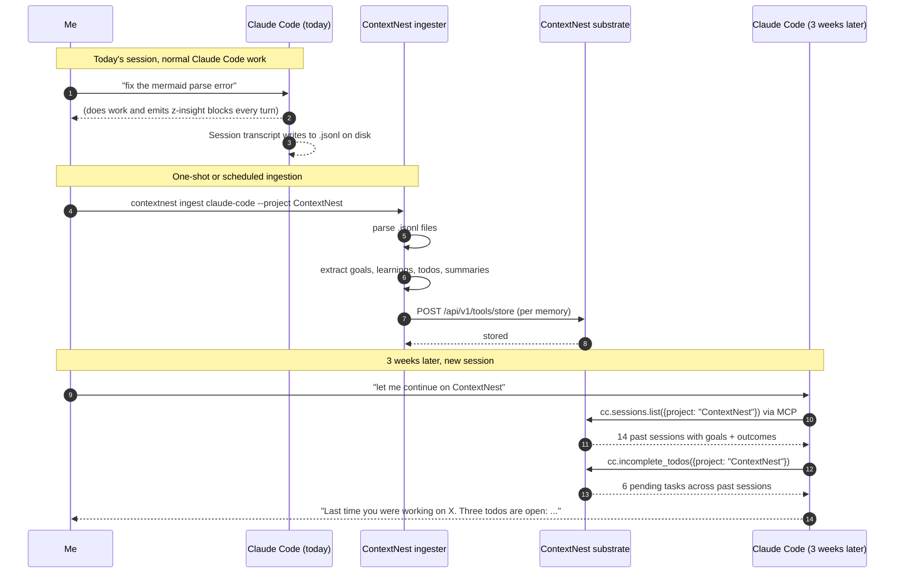
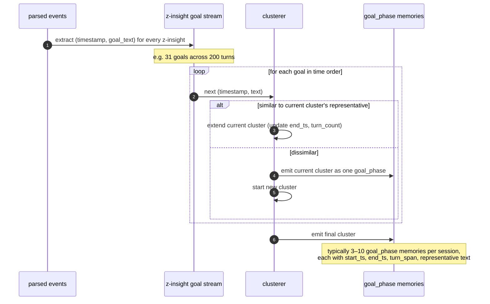
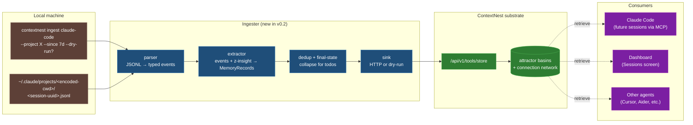
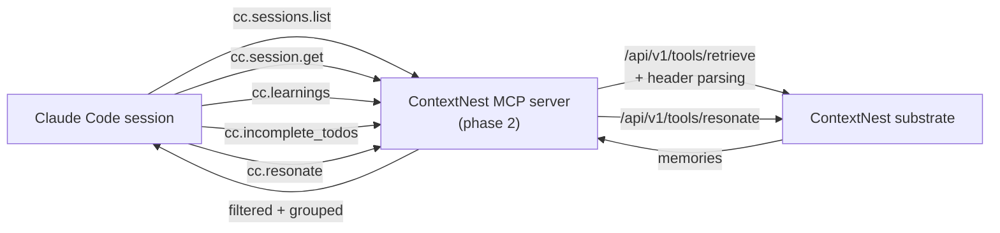
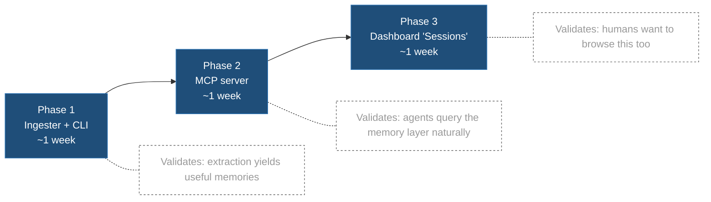

# Claude Code session memory — design discussion

**Status:** Discussion draft. No code yet. Once we agree on the shape,
this doc becomes the spec and implementation follows in a separate PR.

**Last updated:** 2026-05-19

## The problem in one sentence

> Every Claude Code session is amnesiac — opening a project I touched
> three weeks ago, the agent has no idea what we built, what broke,
> what's still pending, or what I learned along the way.

I want my Claude Code sessions to feed ContextNest automatically so
that future sessions (and any other agent talking to ContextNest) can
ask: **what did we do here? what did I learn? what's still pending?**

## The desired user experience



The wedge isn't "search my transcripts". It's **"the agent already
remembers"** before I type anything.

## What gets extracted from each session

The killer detail: my Claude Code sessions already emit
`<z-insight>{...}</z-insight>` JSON blocks at the end of every turn
(the z-dashboard hook). Those blocks are **pre-structured memory** —
the ingester just parses the JSON and stores each field as its own
attractor.

| Source in the .jsonl | Becomes a memory of kind | Cardinality | Why |
|---|---|---|---|
| `ai-title` event | `session_title` | 1 per session | Stable session-level theme synthesised by Claude Code on first turns. The "this is what the whole session was about" label. |
| **Phase-clustered** z-insight goals (see § Finding goals below) | `goal_phase` | 3–10 per session typically | The actual session arc, after clustering consecutive turns that share an intent. One memory per phase with start/end timestamps + turn span. |
| First few `user` messages of the session | `initial_prompt_window` | 1 per session | NOT a goal. Stored at low importance as raw context for "what was the original ask?" — useful when reading back a session, but doesn't pollute the `goal_phase` ranking. |
| `z-insight.top_jobs[]` | `accomplishment` | M per turn | What landed during each segment of the session |
| `z-insight.facts[]` | `learning` | M per turn | Non-obvious things figured out — the gold for future sessions |
| `z-insight.tasks[]` | `todo` | M per turn (deduped to final state per subject) | Task entries with their last-known status |
| `z-insight.current_state` | `state` | M per turn | "Where the work stands right now" — useful for resuming |
| TodoWrite / TaskCreate tool calls | `todo` | Fallback when no z-insight blocks exist | |
| `summary` events (when `/clear` fires) | `summary` | 0–N per session | Compact session summary written explicitly |

A typical 3-hour session yields **30–80 memories** of which ~95% come
from z-insight blocks. Sessions without z-insight (older sessions or
users who disabled the hook) fall back to user-message + TodoWrite +
summary signal — worse, but not useless.

## Finding goals — across turns, not from one message

A goal doesn't live in a single message. It usually emerges from a
**cluster** of consecutive turns:

- Turn 1 user: "I want to do X"
- Turn 2 assistant: clarifying questions
- Turn 3 user: "yes, and also Y, with Z as a constraint"
- Turn 4 assistant: "OK, so the goal is X + Y respecting Z. Plan:..."
- Turns 5–20: work begins, with the same goal across many z-insight
  blocks
- Turn 21 user: "actually pivot — drop Y, focus on W instead"
- Turns 22–40: new goal phase

The z-insight `goal` field captures the agent's running understanding,
but its wording drifts naturally even when the underlying intent
doesn't:

- Turn 5 z-insight: "Audit ContextNest's Rust files for unfinished code"
- Turn 7 z-insight: "Surface all incomplete/dummy/patchy implementations"
- Turn 9 z-insight: "Complete the audit and document findings"

These are *one* goal in three different wordings. Counting them as
three separate memories would be noise.

### Phase-clustering algorithm (phase 1 — simple)



Similarity for phase 1: **simple token-overlap** —
two goals are the same phase if they share ≥60% of their content
words (excluding stop words). Cheap, deterministic, no model calls.

Phase 2 upgrade: replace token-overlap with **embedding cosine
similarity > 0.85** using the substrate's `EmbeddingService`. Better
semantic accuracy, modest per-session cost.

Phase 3 upgrade: when the LlmService is enabled, run an LLM pass to
**synthesize each phase's representative text** from all the goal
wordings in the cluster (rather than picking the longest one).

### Sessions without z-insight blocks

Older sessions or sessions where the dashboard hook is off have no
`z-insight.goal` stream. For those:

1. Take the **first 3–5 user turns** of the session as an "initial
   prompt window".
2. Store the concatenation as a single `initial_prompt_window`
   memory at importance 0.5.
3. When `LlmService` is enabled (phase 2+): run an LLM pass over the
   window to synthesize a `goal_phase` memory.
4. Detect goal-pivots by looking for user turns whose text contains
   pivot markers (`"instead"`, `"actually"`, `"let's pivot"`,
   `"new goal"`, `"change of plan"`). Each pivot creates a new
   phase boundary.

In all cases, the substrate's basin formation does additional
clustering downstream — even if we emit slightly too many goal_phases,
related ones land in the same basin and retrieval still works
correctly.

## Architecture (high level)



## Data flow — one session, end to end

```mermaid
sequenceDiagram
    autonumber
    participant FS as ~/.claude/projects/...
    participant Parser as Parser
    participant Ext as Extractor
    participant Dedup as Dedup
    participant Sink as Sink
    participant Sub as Substrate

    Parser->>FS: read &lt;uuid&gt;.jsonl
    FS-->>Parser: 3627 lines of JSON

    Note over Parser: parse line-by-line<br/>(skip malformed, never crash)
    Parser->>Ext: typed events (user, assistant, summary)

    Note over Ext: for each assistant turn,<br/>scan content for z-insight blocks
    Ext->>Ext: extract goals, top_jobs, facts, tasks, state
    Ext->>Ext: extract TodoWrite / TaskCreate tool calls
    Ext->>Dedup: ~50 raw memory candidates

    Note over Dedup: dedupe by (kind, normalised text)<br/>collapse todos to final status only
    Dedup->>Sink: ~30 deduped MemoryRecords

    par store each
        Sink->>Sub: POST /api/v1/tools/store (memory 1)
        Sink->>Sub: POST /api/v1/tools/store (memory 2)
        Sink->>Sub: POST /api/v1/tools/store (memory N)
    end
    Sub-->>Sink: 200 OK × N
    Sink-->>Sink: report counts by kind
```

The Sink runs ~8 stores concurrently — bounded enough that the
substrate doesn't queue, fast enough that a 50 MB session ingests in
under 3 seconds end-to-end.

## Storage shape — how a memory looks once stored

The seven-tool API only takes `content` + `importance` + `session_id`.
To preserve the structured metadata (kind, project, source-session,
timestamp) without changing the API, the ingester encodes it as a JSON
header line at the top of the content:

```
{"kind":"learning","project":"/Volumes/docker-ssd/.../ContextNest","src_session":"4c998114-cf34-4dc1-8b84-1db67db8b327","ts":"2026-05-18T07:00:11Z"}

`else` is a reserved keyword in mermaid sequenceDiagram Note text — replace with "otherwise" to avoid the parse error.
```

The `session_id` used for the seven-tool API is `cc-<8-char-uuid>` so
memories from different sessions stay namespaced; the full UUID lives
in the header for the future MCP server to parse out for cross-session
queries.

## What the MCP server (phase 2) would expose



The MCP server is a thin parsing + filtering layer on top of the
seven-tool API. It doesn't store anything itself; it translates
"give me incomplete todos for project X" into the right
`retrieve` + header-filter combination.

## Three phases (each independently shippable)



Phase 1 is enough to validate the entire thesis — once memories are
stored, you can already query them via curl, dashboard playground, or
manual seven-tool calls. Phases 2 and 3 are about ergonomics.

## Open design questions (where I want your input)

1. **Store the raw assistant text alongside the structured memories?**
   - Pro: complete fidelity, you can search the actual conversation.
   - Con: 50× more storage, dilutes activation patterns in the field.
   - **My lean:** No by default, opt-in via `--store-raw-turns` flag.

2. **Sessions without z-insight blocks** (older sessions / different
   hook config). Fall back to first-user-message + TodoWrite +
   summary, or skip entirely?
   - **My lean:** Fall back. Even rough goal + todo signal beats
     amnesia. We mark the memories as `extraction_quality: "low"` in
     the JSON header so consumers can de-prioritise them.

3. **Multi-session dedupe.** If "fix CI" recurs as a goal across 5
   sessions, do we want 5 separate memories or one merged?
   - **My lean:** Keep separate. Importance + timestamp differentiate
     them, and the substrate's basin formation will cluster them
     anyway — that's the whole point of the substrate.

4. **Watch mode** — continuous tail of new events as the session
   writes them, vs one-shot.
   - **My lean:** Defer to phase 2. The MCP server is the natural
     place for a long-running watcher; phase 1's one-shot CLI is
     enough to validate the extraction.

5. **Privacy / opt-out.** Some transcripts contain secrets typed in
   prompts (API keys, customer data). How aggressive should the
   first-pass filter be?
   - **My lean:** Phase 1 trusts the local filesystem (no
     filtering). Phase 2 adds an opt-out: `~/.claude/projects/<dir>/
     .cn-ignore` excludes a project entirely; per-session
     `--exclude-pattern <regex>` excludes lines matching a pattern.

6. **Session id namespacing.** `cc-<8-char-uuid>` keeps each Claude
   Code session isolated in the substrate. Alternative: one session
   id per project (`cc-<project-slug>`) and let memories share basins
   across sessions in that project.
   - **My lean:** Per-session for phase 1 (safe + reversible).
     Per-project would prevent some really useful cross-session
     resonance — open to switching if you have a strong intuition.

7. **What goes into `importance`?** Currently I'm proposing:
   - `session_title` = 0.85 (stable session-level theme from `ai-title`)
   - `goal_phase` = 0.85 (each clustered goal phase, from the
     algorithm above)
   - `initial_prompt_window` = 0.45 (just raw context — NOT a goal)
   - `accomplishment` = 0.75
   - `learning` = 0.8 (these are the most valuable for future
     sessions)
   - `todo` = 0.75 if completed, 0.65 if pending, 0.55 if failed
   - `state` = 0.7
   - `summary` = 0.95 (highest — these are explicit session-level
     recaps)
   - Open to re-balancing.

8. **Phase-clustering similarity threshold.** Phase 1 uses token-
   overlap with a 60% threshold. Too loose and unrelated goals merge;
   too tight and the same goal splits into noisy duplicates. A few
   open sub-questions:
   - Should we exclude stop words and lowercase before comparing? (My
     lean: yes — punctuation- and case-insensitive token overlap.)
   - Should a goal phase that spans only 1–2 turns be discarded as
     noise? (My lean: keep it. A real one-turn pivot is meaningful;
     filtering loses signal.)
   - When a phase has 5+ distinct wordings of the same goal, pick the
     longest or the most recent as the representative? (My lean:
     longest — usually carries the most detail. Open to flipping.)

## Next step

If you're happy with this shape, I'll convert this doc into the
implementation spec and build phase 1. If anything in the open
questions above lands differently, we tweak first.

## Related docs

- [v0.2-to-v1.0.md](v0.2-to-v1.0.md) — broader v0.2 milestone context
- [../usage.md](../usage.md) — seven-tool API the ingester pushes through
- [../architecture.md](../architecture.md) — substrate internals
