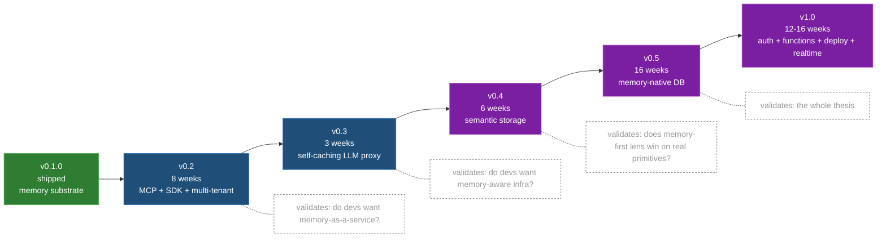

# ContextNest Roadmap — v0.2 → v1.0

**Status:** Proposal. Not committed scope until each milestone's epic doc
ships and is approved. Sequencing locked; per-milestone scope is a
working estimate.

**Last updated:** 2026-05-19

## Strategic position

> Every other backend treats memory as the developer's problem. You build
> it on top, you pay the integration tax, you wire a vector store + cache
> + LLM gateway + relational store separately. **ContextNest is the first
> backend where memory is the substrate.** Every database row, every
> uploaded file, every function call, every LLM completion — automatically
> queryable by what it means, not just by exact ID.

The product is not a memory plugin. It is an **agent-native backend** in
which the seven-tool memory language (`store / retrieve / update /
discard / summarize / reconstruct / resonate`) is the substrate every
other primitive sits on top of. The work of v0.2 → v1.0 is making that
real, primitive by primitive, with each milestone independently
shippable so the thesis validates as we go.

## Target audience

We are not competing for "generic BaaS shoppers". The audience is anyone
currently stitching infrastructure together by hand to make LLM agents
work:

- **Custom agent builders** — LangChain, LlamaIndex, Vercel AI SDK shops
  currently glueing pgvector + Redis + Postgres + LangSmith into "memory"
  by hand.
- **RAG-heavy SaaS** — legal-research, customer-support, internal-docs
  companies maintaining a separate retrieval pipeline alongside their
  app DB; same data, two systems, sync nightmare.
- **Voice-agent companies** — Bland, Vapi, custom builders who
  desperately need cross-call memory; today they hack it with Redis +
  manual prompt-stuffing.
- **Code-agent power users** — Aider, Cursor extensions, custom Claude
  Code setups that lose context every restart and will pay for "memory
  companion that runs locally".
- **Indie devs shipping agentic apps** — want one `cargo run -- serve`
  or one Docker container instead of provisioning four services.

The wedge is not "I am cheaper than Supabase". It is "I make a category
of work disappear".

## The five-milestone bet

Each milestone is independently shippable and validates a separate
hypothesis. If a milestone's demo doesn't land with developers, the
later milestones get reconsidered before they're committed to.

### v0.2 — MCP + SDK + multi-tenancy (8 weeks)

**Goal:** make the existing memory substrate plug-and-play for any LLM
agent without code change.

**What ships:**
- MCP server wrapping the seven HTTP tools (`cn_store`, `cn_retrieve`,
  …) so any MCP-speaking agent (Claude Code, Cursor, Continue, Zed,
  Aider) gets memory by adding ContextNest to `.mcp.json`.
- `@contextnest/sdk` (TypeScript) with `createClient({ baseUrl,
  anonKey })` then `client.memory.<verb>()` ergonomics.
- Multi-tenant `(project_id, session_id)` namespacing in
  `SessionIndex`. Server-enforced isolation.
- Anon key / JWT auth model. Bearer-token middleware.

**Validates:** Are developers willing to delegate memory entirely
instead of building it? Are they willing to install a substrate they
don't fully understand?

**Killer demo:** `curl install.contextnest.dev | sh`, then add ten
lines to `~/.claude/settings.json`, then watch Claude remember what
you discussed yesterday.

**Success metrics:** 1k npm-downloads/week of `@contextnest/sdk`, 50+
GitHub stars from organic discovery, ten "I tried it and it works"
posts in the ecosystem.

### v0.3 — Self-caching LLM proxy (3 weeks)

**Goal:** prove that the memory substrate, applied to a single
primitive (LLM calls), produces visceral measurable value.

**What ships:**
- OpenAI-compatible HTTP proxy at `POST /llm/v1/chat/completions`.
- Every request stored as an attractor on `(prompt + model +
  temperature + system)`.
- Cache hits served from substrate when similarity above configurable
  threshold. Configurable freshness window.
- PII opt-in for prompt fingerprinting. Encrypted-at-rest by default.

**Validates:** Do developers want memory-aware *infrastructure*, not
just memory-the-feature?

**Killer demo:** "Change your `base_url` to ContextNest. Watch your
OpenAI/Anthropic bill drop 40%. No other code changes." One tweet,
shareable, viscerally measurable.

**Success metrics:** Five public posts of dollar savings from real
users. Cache hit rates >25% on real workloads.

**Detailed spec:** [v0.3-llm-proxy.md](v0.3-llm-proxy.md).

### v0.4 — Semantic storage (6 weeks)

**Goal:** first "rethink an existing primitive through the memory
lens" milestone. Files queryable by content, not just path.

**What ships:**
- S3-compatible storage API at `POST /storage/v1/objects`.
- Auto-embedding pipeline on PUT: every uploaded file's text content
  gets embedded + indexed as an attractor.
- New endpoint: `GET /storage/v1/objects/search?q=...` returns objects
  ranked by content similarity.
- `cn.resonate` works over a whole bucket — "find emergent themes in
  this bucket".

**Validates:** Does the memory-first lens give measurable wins on a
primitive that every BaaS already has? Is the dev experience clean
enough that developers prefer it to bolting pgvector onto S3?

**Killer demo:** "Drop semantic search into your app in three lines —
no embedding pipeline, no vector DB, no sync job."

**Success metrics:** Stories from teams who replaced a pgvector
sidecar with ContextNest's storage. Three case studies.

### v0.5 — Memory-native DB layer (16 weeks)

**Goal:** the hard one. The bet that validates the whole thesis.

**What ships:**
- PostgreSQL adapter that mirrors writes into the attractor substrate.
- `RESONATE WITH '<query>'` clause extending SELECT. Returns rows that
  participate in emergent activation patterns even when no individual
  predicate matches.
- Reconstruct-as-fallback when WHERE returns no rows: the query layer
  can opt into "if exact match fails, return the closest reconstructed
  answer with a confidence score".
- Foreign-key edges automatically populate the ConnectionNetwork.

**Validates:** Are developers willing to use a query language extension
that no one else has? Is `RESONATE WITH` valuable enough on real
workloads that "weird but novel" becomes "we can't live without it"?

**Killer demo:** `SELECT * FROM support_tickets RESONATE WITH
'frustrated about pricing'` returns tickets whose whole-row signature
matches the sentiment, not because any column matched literally.

**Success metrics:** One paying customer using `RESONATE WITH` in
production. A blog post from a user titled something like "the SQL
clause I didn't know I needed".

**This milestone is the make-or-break.** If `RESONATE WITH` doesn't
land, the rest of the roadmap gets re-thought before commitment.

### v1.0 — Auth, functions, deploy, realtime (12-16 weeks)

**Goal:** feature-complete agent-native backend. Each remaining
primitive built with memory as the substrate.

**What ships:**
- **Auth:** identity as a memory trajectory. JWT scopes scope memory
  visibility. Sign-in mounts your memory namespace.
- **Edge functions:** never stateless. Every invocation auto-retrieves
  memory context by `(fn_name, args)`. Outputs auto-store. Functions
  can call `cn.resonate` mid-execution.
- **Deployment:** every deploy is a high-importance memory. "Show me
  the pattern across the last 10 deploys that broke."
- **Realtime:** standard WebSocket pub/sub *plus* `cn.resonance`
  subscriptions — get pushed when the substrate detects a new
  emergent pattern matching a query you registered.

**Validates:** does the integrated story — five memory-native
primitives in one substrate — feel like a genuine product, or does it
fall apart at the seams?

**Killer demo:** build a non-trivial agent app on ContextNest in a
weekend, show the recording. The audience sees one Docker container
and one SDK; everything else just works.

**Success metrics:** 10+ production deployments. First commercial
contract for self-hosted enterprise install.

## Honest risks + open questions

The roadmap is opinionated. Each of these could kill it:

| Risk | Why it bites | How we'd notice + react |
|---|---|---|
| **v0.5 RESONATE WITH doesn't land.** SQL extension that nobody uses turns into dead code + reputational damage ("they invented syntax nobody wanted"). | If after v0.4 ships, dev feedback is "memory tools great, don't need them in SQL", abandon v0.5 query extension; ship a separate semantic-query API instead. | First 3 months of v0.5 user research is interviews + prototyping; no production-grade work until 5+ devs say "this would change how I write apps". |
| **Self-caching LLM proxy commodities fast.** Cloudflare, OpenRouter, LiteLLM could ship the same thing in 2 weeks. | Treat v0.3 as marketing, not moat. The moat is v0.4+v0.5. v0.3's role is awareness. | Acceptable. v0.3 is intentionally cheap (3 weeks) to act as a wedge. |
| **Single-binary mode incompatible with multi-tenancy.** The substrate currently assumes one process; making it both embedded-local AND multi-tenant-cloud may require two codepaths. | If v0.2 finds the divergence too expensive, split into two products: `contextnest` (cloud, multi-tenant) and `contextnest-local` (single-user, embedded). | Architectural decision point at v0.2 week 4. |
| **PII concerns in the LLM proxy.** Storing prompts is storing user data. GDPR/EU users will need encryption + redaction + deletion guarantees. | Designed-in from v0.3: encrypted-at-rest, configurable redactor, hard-delete propagation. | Documented in [v0.3-llm-proxy.md](v0.3-llm-proxy.md). |
| **Multi-tenancy security is harder than expected.** Cross-tenant memory leak via reconstruction or resonate is a data breach. | v0.2 ships with project_id enforced server-side on every query path. Audit + red-team. | First external auditor review before v0.2 → public availability. |
| **The market just isn't there yet.** Maybe agent-backend-as-a-service is two years too early. | At-v0.3 signal: <500 npm downloads in 8 weeks of public availability = thesis isn't landing. | Pivot to "memory companion for known agent frameworks" (Path A from earlier strategy discussion). |

## Decision points along the way

- **End of v0.2:** signal check. If <500 npm-downloads/week + <50
  stars, slow v0.3 and lean into marketing.
- **End of v0.3:** revenue signal check. Run a 4-week paid tier
  experiment ("self-caching proxy, $X/month for the cloud version").
  If no paying users in 4 weeks, the bill-savings thesis doesn't
  monetise → revisit pricing model before v0.4.
- **End of v0.4:** semantic-storage adoption signal. If teams aren't
  swapping out their pgvector sidecars for it, v0.5 is too ambitious
  → ship `cn.resonate` as a standalone HTTP API instead of a SQL
  extension.
- **End of v0.5:** thesis is proven or it isn't. Either commit to v1.0
  (the integrated backend) or pivot to "the memory layer everyone
  uses".

## What this is not

- **Not a Supabase / InsForge / Firebase clone.** Don't pitch on
  feature parity. We will ship a smaller surface than them on
  purpose, with one organizing principle they can't retrofit.
- **Not a vector database with extra features.** pgvector +
  Weaviate + Pinecone are vector stores; this is a substrate. The
  difference matters: vectors are what you store; the substrate is
  what computes over them.
- **Not "AI tooling".** Tooling is a Notion plugin or a VSCode
  extension. This is infrastructure.
- **Not memory-only.** Memory is the lens. The product is a backend.
- **Not infrastructure-team-targeted.** Pitch is to the agent builder,
  not the SRE. SRE adoption is downstream.

## Where to read next

- [v0.3-llm-proxy.md](v0.3-llm-proxy.md) — concrete spec for the
  first post-substrate milestone (the cheapest, fastest validator)
- [../architecture.md](../architecture.md) — substrate internals
- [../usage.md](../usage.md) — current v0.1.0 surface
