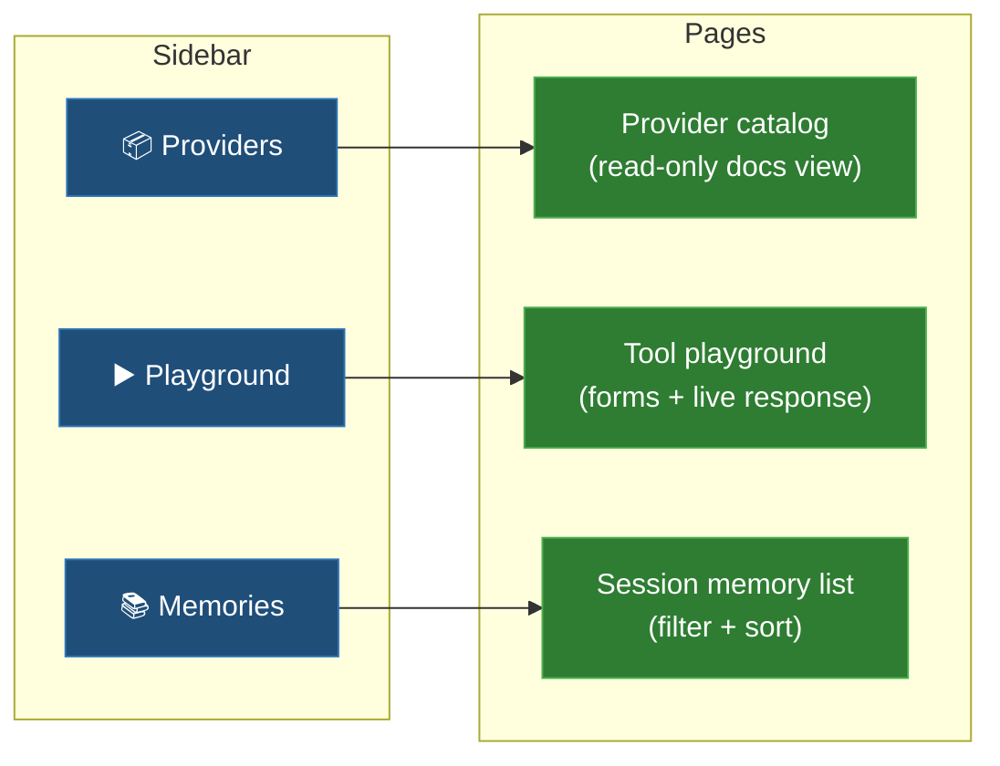

# v0.2 UI — Dashboard scaffold

**Status:** Proposal + first-pass implementation in `web/`. Iterating on
top of the scaffold lands as follow-up PRs.

**Dependencies:** None — the dashboard is purely client-side and talks to
the existing v0.1.0 HTTP API. The "Providers" screen renders against the
static built-in provider catalog from
[extensibility.md](../extensibility.md) (no new backend endpoint
required).

**Last updated:** 2026-05-19

## TL;DR

A self-contained React dashboard at `web/` that exposes ContextNest's
seven-tool memory API through a clickable surface. Three screens for the
v0.2 cycle:

1. **Providers** — read-only catalog of built-in LLM + embedding
   providers with copy-paste env-var configs.
2. **Playground** — forms for `store`, `retrieve`, `reconstruct`,
   `resonate` that hit the live API and show responses.
3. **Memories** — per-session list of stored fragments with importance,
   basin id, recency.

This is the *minimum viable dashboard*. The basin visualizer (the killer
screen) lands in v0.4-ui after semantic storage ships and the substrate
emits enough state for the viz to chew on.

## Why we built fresh instead of forking InsForge

Five reasons, in order of cost:

1. Their information architecture maps to Auth / DB / Storage / Functions
   — ours maps to seven memory verbs + attractor geometry. Renaming +
   restructuring takes longer than starting clean.
2. Apache-2.0 → MIT absorption requires preserving their NOTICE file
   forever and complicates the LICENSE story.
3. The roadmap doc explicitly positions ContextNest as "not Supabase
   clone, not InsForge clone" — visually shipping a recognisably-InsForge
   UI undercuts that.
4. Forks decay fast unless you commit to walking away from upstream;
   we'd silently miss their improvements.
5. The visual differentiator (real-time attractor basins) deserves a
   greenfield design — bolting it onto a primitive-CRUD layout
   underspends the opportunity.

We *do* steal three patterns from their UX (left-sidebar primitive
navigation, connect-MCP onboarding flow, MCP-usage logs timeline) — but
re-implement them in our own components.

## Tech stack

| Layer | Pick | Why |
|---|---|---|
| Build | Vite 6 + React 19 + TypeScript 5.5+ | Fastest dev loop in the ecosystem; what most agentic-coding repos use |
| Styling | Tailwind v4 + shadcn/ui patterns | MIT, copy-into-codebase model — we own the components, no npm component lock-in |
| Routing | TanStack Router | Type-safe routes, code-based config keeps the scaffold small |
| Data | TanStack Query v5 | The standard for "React app talking to REST" — handles caching, retries, optimistic updates |
| Client state | Zustand v5 | Small, no boilerplate, no Redux drama |
| Viz (v0.4) | d3 + react-force-graph | Three.js would be overkill for a 2D basin graph |
| Package manager | pnpm | Faster + deterministic; cleaner monorepo story when we add SDK package |

Tailwind v4 is the right pick over v3 because the new `@tailwindcss/vite`
plugin removes the PostCSS chain and the CSS-first config (`@theme { }`
in the stylesheet) is meaningfully cleaner. The migration story from v3
is well-documented if any contributor only knows v3.

## Monorepo layout

```
ContextNest/
├── src/                  # existing Rust substrate
├── tests/                # existing Rust tests
├── docs/                 # existing docs
├── web/                  # NEW — the dashboard
│   ├── package.json
│   ├── vite.config.ts
│   ├── tsconfig.json
│   ├── tailwind.config.ts  (optional — v4 is mostly CSS-first)
│   ├── index.html
│   ├── .env.example
│   ├── .gitignore
│   ├── README.md            # dev loop
│   └── src/
│       ├── main.tsx
│       ├── App.tsx
│       ├── index.css
│       ├── lib/
│       │   ├── api.ts        # typed client for the seven tools
│       │   ├── cn.ts         # clsx + tailwind-merge helper
│       │   └── query-client.ts
│       ├── components/
│       │   ├── layout/
│       │   │   ├── shell.tsx     # outer chrome
│       │   │   └── sidebar.tsx   # primitive navigation
│       │   └── ui/
│       │       ├── button.tsx
│       │       ├── card.tsx
│       │       └── input.tsx
│       └── routes/
│           ├── providers.tsx
│           ├── playground.tsx
│           └── memories.tsx
└── Cargo.toml
```

Single repo, single CI surface, single Docker image eventually serves
both the substrate and the built `web/dist/` static assets via Axum.
The static-serving Axum integration lands as a separate v0.2.1 PR
once the dashboard has at least two screens worth shipping.

## Information architecture



Future screens (NOT v0.2-ui scope):

- **Logs** — MCP + HTTP request log, modeled on InsForge's logs view
- **Cache stats** — lands with v0.3 LLM proxy
- **Attractor basin viewer** — the v0.4-ui differentiator
- **Settings / project switcher** — lands with v0.2 multi-tenancy

## API integration

All three screens talk to the substrate via the seven-tool HTTP API.
TanStack Query provides:

- Auto-caching by `(tool, body)` cache key
- Stale-while-revalidate refetch on focus
- Optimistic updates for `store` and `discard`
- Retry with exponential backoff on transient network errors

Base URL comes from `VITE_API_BASE_URL` (default
`http://localhost:8080`). Dev mode proxies through Vite's dev server so
the dashboard can run on port 5173 without CORS surgery on the substrate.

## Implementation phases

| Phase | Days | Scope |
|---|---|---|
| 1 — Scaffold | 1-2 | This PR. Vite + React + Tailwind v4 + shadcn primitives + TanStack Router/Query + typed API client + working "Providers" screen + stubs for the other two |
| 2 — Playground | 3-4 | Wire the seven-tool forms with response views; markdown-render reconstruct/summarize outputs; session_id input persisted to localStorage |
| 3 — Memories | 3-4 | Per-session fragment list with filters (importance, basin, date); soft-delete UI; importance update inline |

Phases 2 and 3 are separate PRs; this PR lands phase 1.

## Success metrics (for the whole v0.2-ui milestone, end of phase 3)

| Metric | Target | How measured |
|---|---|---|
| First-time-user can configure a provider + store a memory + retrieve it without reading docs | Yes | Manual usability walkthrough with 5 devs |
| Lighthouse performance score | ≥90 | CI on build |
| Type errors at strict tsc | 0 | CI `pnpm typecheck` |
| Bundle size (gzipped) | <250 KB | CI step compares to baseline |
| Time-to-interactive on a 4G connection | <1.5s | Lighthouse |

## Open questions

1. **Auth surface.** v0.2 multi-tenancy lands the anon-key/JWT model. Do
   we show a "sign in" flow in this milestone, or defer to v0.2.1 with a
   simple "set API key in localStorage" gate? **Recommendation:** defer.
   This PR's screens work without auth; lock-down lands with the
   substrate's auth.
2. **Real-time updates.** Should `memories` poll every N seconds, or
   subscribe via WebSocket? **Recommendation:** poll for v0.2-ui (5s
   stale time on TanStack Query handles this implicitly). WebSocket
   subscription lands with v0.4-ui basin viewer where it's actually
   needed.
3. **Markdown rendering of reconstruct/summarize output.** Hand-roll or
   pull in `react-markdown` + a syntax-highlighter? **Recommendation:**
   `react-markdown` + `rehype-highlight` — ~30 KB gz delta, but the UX
   win is large.
4. **Static-serve via Axum vs separate deploy.** Embed `web/dist/` into
   the binary via `rust-embed` for single-binary distribution, or serve
   from a CDN? **Recommendation:** embed for self-hosters; the binary
   stays small (~600 KB delta gzipped), and self-hosted is the v0.1
   audience anyway. Standalone CDN deploy comes for the cloud-hosted
   product later.
5. **Dark mode.** Default to dark, light as toggle, or system-follow?
   **Recommendation:** dark default + toggle. Most agent-builder users
   run dark IDEs.

## What this is not

- **Not a marketing site.** The dashboard is for operating the
  substrate; the marketing site lives on its own domain when we have
  one.
- **Not a no-code agent builder.** It exposes the seven-tool API; it
  doesn't try to be Zapier-for-agents.
- **Not the basin viewer.** That's the headline feature for v0.4-ui;
  building it now would force premature commitments before we
  understand the multi-tenant data model.
- **Not feature parity with InsForge's dashboard.** They have ~15
  primitive-management screens because they have ~15 primitives. We
  have 7 verbs and one substrate.

## Where to read next

- [v0.2-to-v1.0.md](v0.2-to-v1.0.md) — full roadmap context
- [`web/README.md`](../../web/README.md) — dev loop, scripts, env vars
- [extensibility.md](../extensibility.md) — provider catalog that the
  Providers screen renders
