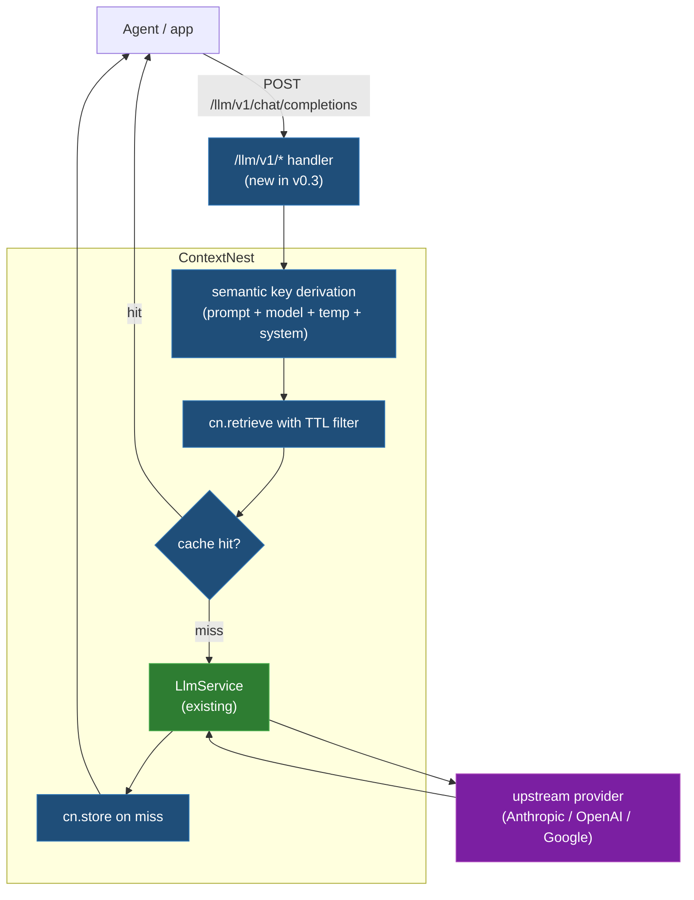

# v0.3 — Self-caching LLM proxy

**Status:** Proposal. Targets ~3 weeks engineering, mostly extending
the existing `LlmService`. Reviewable artifact; not committed until
this doc is approved.

**Dependencies:** v0.2 (MCP + SDK + multi-tenancy) must ship first —
multi-tenant `(project_id, ...)` namespacing is required so users'
cached prompts can't bleed across projects.

**Last updated:** 2026-05-19

## TL;DR

ContextNest exposes an OpenAI-compatible HTTP endpoint that proxies
to upstream LLM providers (Anthropic, OpenAI, Google) while
auto-storing every `(prompt, completion)` pair as a memory attractor.
Future requests with semantically-similar prompts hit the cache from
the substrate instead of calling the upstream — cost + latency drop
without any code change beyond pointing `base_url` at ContextNest.

**One-line user value:** "Change your `base_url` to ContextNest.
Watch your OpenAI bill drop 40%. No other code changes."

## Motivation

Three things make this the right first milestone after v0.2:

1. **Cheap.** The plumbing already exists. `LlmService` already routes
   to multi-provider; we just add an HTTP front + a substrate-backed
   cache layer.
2. **Visceral demo.** Dollar savings are concrete. A user can run a
   side-by-side test in 10 minutes and see the number.
3. **Validates the thesis.** If memory-backed caching produces real
   savings on real workloads, the bigger thesis ("memory is the
   substrate every backend primitive sits on") is one step closer to
   proven.

## User-facing surface

Drop-in replacement for the OpenAI HTTP client base URL:

```python
from openai import OpenAI

client = OpenAI(
    base_url="https://contextnest.example.com/llm/v1",  # was api.openai.com/v1
    api_key="cn_proj_...",  # ContextNest project key, not the upstream provider key
)

# Everything below is unchanged
response = client.chat.completions.create(
    model="gpt-4o-mini",
    messages=[{"role": "user", "content": "Explain attractor basins."}],
)
```

The endpoints we serve:

| Endpoint | Behaviour |
|---|---|
| `POST /llm/v1/chat/completions` | OpenAI-compatible. Cache-checks substrate, calls upstream on miss, stores response. |
| `POST /llm/v1/embeddings` | OpenAI-compatible. Cache by exact-text fingerprint. |
| `GET /llm/v1/models` | Proxies to upstream `models` list, filtered by what's configured. |
| `GET /llm/v1/cache/stats` | ContextNest-specific. Returns hit-rate, cost saved, latency saved. |

Upstream provider credentials live in ContextNest's server config, not
the request. The user's request only carries the project key — the
proxy decides which provider to fan out to based on the model name +
project policy.

## Architecture



New code is roughly:

- `src/api/llm_proxy.rs` — HTTP handlers for the OpenAI-compatible
  surface (~600 LOC).
- `src/services/llm_cache.rs` — cache-key derivation + freshness
  policy + hit/miss accounting (~400 LOC).
- `src/api/llm_proxy/openai_shapes.rs` — request/response shapes
  matching OpenAI's API exactly (~300 LOC, mostly serde derives).
- `tests/llm_proxy_integration.rs` — end-to-end tests against
  recorded fixtures (~500 LOC).

Existing code reused as-is: `LlmService`, `MemoryAttractorManager`,
`SessionIndex`, `EmbeddingService`. Total new code: ~1800 LOC + tests.

## Cache key derivation

The cache key is a tuple, not a hash:

```rust
struct CacheKey {
    project_id: ProjectId,
    model: String,              // "gpt-4o-mini"
    temperature: OrderedFloat,  // 0.7 → bucketed at 0.05 granularity
    system_prompt_hash: u64,    // sha256(system_prompt).truncated
    user_prompt_embedding: Vec<f32>,  // semantic key
}
```

Retrieval semantics:
- Exact-match on `project_id`, `model`, `temperature` bucket,
  `system_prompt_hash`.
- Semantic-match on `user_prompt_embedding` via the substrate's
  attractor activation. Configurable similarity threshold (default
  0.92).
- TTL filter applied last (default 3600s, per-request overridable via
  `x-cn-cache-max-age` header).

The substrate already does semantic matching; we just need to scope
it correctly (filter by project + exact-match fields before activating
the field).

## Freshness policy

Three knobs, in priority order:

1. **Per-request override** — `x-cn-cache-max-age: 0` to skip cache,
   `x-cn-cache-max-age: 86400` to allow day-old hits, etc.
2. **Per-project config** — set in the project's dashboard or via
   the SDK; defaults are sensible for the project's workload.
3. **Per-model defaults** — `gpt-4o-mini` cached longer than `gpt-5`
   (assumption: smaller models cache better because they're called
   for boilerplate tasks).

## Security model

The big risk: cached prompts are stored data. We must be defensible.

| Concern | Mitigation |
|---|---|
| **Cross-project leak.** A user's prompt cache must never serve another project's user. | Multi-tenancy enforced server-side at the cache-key level; `project_id` is the first field of the key, no exception path bypasses it. |
| **PII in prompts.** Storing raw prompts may store user PII. | Encrypted-at-rest by default (use existing `key_management` AES-GCM). Configurable redactor pipeline (regex + LLM-based) runs before store. Per-project opt-out for projects with sensitive data ("forward-only mode" — no caching, just bill counting). |
| **Hard delete.** Users must be able to purge a cached prompt + completion. | `DELETE /llm/v1/cache/entries/<id>` triggers hard-discard through the substrate (skip the soft-delete path; remove embedding too). |
| **Upstream API keys.** ContextNest holds the provider keys. | Keys in `key_store` (existing trusted-key infra), never logged, never returned in API responses, project-scoped. |
| **Replay / spoofing.** An attacker steals a project key and replays. | Standard rate-limiting + project-key rotation. `cn_*_proj_<id>` key format with per-key budget caps. |
| **Cache poisoning.** Could a malicious actor pre-seed cache with bad completions to mislead future requests? | Only the project's own upstream calls land in its cache. No cross-project sharing. To poison, an attacker has to compromise the project's auth. |

## Implementation phases

Three phases of ~1 week each.

### Phase 1 — Plain proxy (week 1)
Ships the OpenAI-compatible endpoints, forwards to `LlmService`, no
caching yet. Validates the request/response shapes match real
OpenAI/Anthropic/Google SDKs.

Exit criteria:
- `openai` Python SDK, `@anthropic-ai/sdk`, and Google's `generative-ai`
  Node SDK all work against the proxy with only a `base_url` change.
- Recorded-fixture tests pass for chat + embeddings.
- `models` endpoint correctly reports what the configured providers
  expose.

### Phase 2 — Cache layer (week 2)
Adds cache-key derivation + substrate lookup + auto-store. No PII
redaction yet (opt-in only).

Exit criteria:
- Cache hit serves response in <100ms p95.
- Substrate writes complete in <50ms p95 (async, off the critical
  path).
- `GET /llm/v1/cache/stats` returns accurate hit-rate + cost-saved
  numbers.
- Two demo workloads documented (`benchmarks/llm_proxy_cache_demo.md`)
  showing >25% hit rate on realistic patterns.

### Phase 3 — Security + redaction (week 3)
Encrypted-at-rest cache entries. Configurable redactor pipeline.
Hard-delete propagation.

Exit criteria:
- All cached prompts encrypted via existing AES-GCM keygen.
- PII redactor catches the OWASP top patterns (emails, phone numbers,
  CC numbers, names via NER fallback).
- Hard-delete removes the embedding from the field too.
- Security review checklist signed off (write the checklist in
  `SECURITY.md` first; this is a forcing function to harden the
  whole substrate's data-handling).

## Success metrics

| Metric | Target by week 4 post-ship | How measured |
|---|---|---|
| Public posts showing dollar savings from real users | ≥5 | Tweet/blog search + user reports |
| Cache hit rates on real production workloads | ≥25% average across users | `GET /llm/v1/cache/stats` aggregated |
| p95 cache-hit latency | <100ms | Synthetic load test |
| Active projects using the proxy | ≥50 | Server-side telemetry on project keys |
| Net Promoter signal (qualitative) | At least one "we can't live without this" message from a paying user prospect | DMs, sales calls, GitHub issues |

If by week 8 hit-rate is <10% across users, the cache-key derivation
is wrong → re-design before pushing v0.4. If hit-rate is >50% but
nobody's blogging about it, the marketing is wrong → fix the
positioning, not the product.

## Open questions

1. **Streaming responses.** OpenAI's chat endpoint supports SSE
   streaming. Caching a streamed response means buffering it; serving
   from cache means *replaying* the stream with synthetic chunks. Is
   this worth the complexity in v0.3, or do we explicitly only cache
   non-streaming calls and document the limitation?
2. **Embeddings caching.** Embeddings are cheap per-call but high-
   volume. Exact-match cache (text-hash key) is trivial; semantic
   cache is dubious (the value of embedding is in the vector itself).
   Recommendation: ship exact-match only.
3. **Multi-turn conversation caching.** Caching `messages: [system,
   user, assistant, user, assistant, user]` arrays is tricky — small
   variations in earlier turns invalidate the whole tail. Open
   question: cache at the conversation level (whole history → next
   completion) or just per-turn (final user msg + system → assistant
   reply)? Recommendation: ship per-turn; document the limitation.
4. **Tool-use / function-calling.** OpenAI's tool-use returns
   structured arguments; caching those is high-value (deterministic
   tool calls) but the semantic key must include the available tool
   list. Recommendation: defer to v0.3.1.
5. **Pricing model.** Free tier with rate limits? Paid tier scaling
   with cached-tokens? Open. Goes through the v0.3 → v0.4 decision
   gate.

## What this is not

- Not a load balancer or fallback router. Single provider per call;
  the routing decision is made by `LlmService` config, not the cache.
- Not a content-moderation gateway. Pass-through for v0.3. Filtering
  is a v0.4+ feature if user demand warrants.
- Not a fine-tuning platform. ContextNest doesn't train models. The
  proxy is for inference only.
- Not OpenRouter. OpenRouter aggregates provider keys; we aggregate
  *memory* on top of provider keys.

## Where to read next

- [v0.2-to-v1.0.md](v0.2-to-v1.0.md) — full roadmap context for why
  this milestone is sequenced where it is
- [../architecture.md](../architecture.md) — how the existing substrate
  works (the cache layer plugs into the manager directly)
- [`src/services/llm.rs`](../../src/services/llm.rs) — current
  `LlmService` that the proxy wraps
